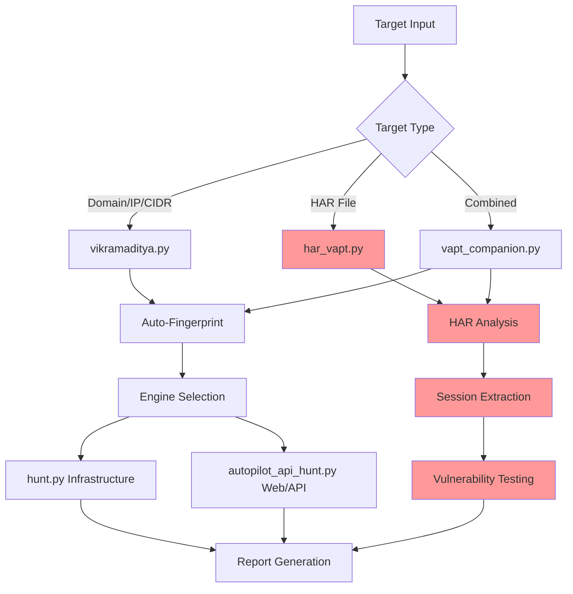

<div align="center">

```
 ██╗   ██╗██╗██╗  ██╗██████╗  █████╗ ███╗   ███╗ █████╗ ██████╗ ██╗████████╗██╗   ██╗ █████╗
 ██║   ██║██║██║ ██╔╝██╔══██╗██╔══██╗████╗ ████║██╔══██╗██╔══██╗██║╚══██╔══╝╚██╗ ██╔╝██╔══██╗
 ██║   ██║██║█████╔╝ ██████╔╝███████║██╔████╔██║███████║██║  ██║██║   ██║    ╚████╔╝ ███████║
 ╚██╗ ██╔╝██║██╔═██╗ ██╔══██╗██╔══██║██║╚██╔╝██║██╔══██║██║  ██║██║   ██║     ╚██╔╝  ██╔══██║
  ╚████╔╝ ██║██║  ██╗██║  ██║██║  ██║██║ ╚═╝ ██║██║  ██║██████╔╝██║   ██║      ██║   ██║  ██║
   ╚═══╝  ╚═╝╚═╝  ╚═╝╚═╝  ╚═╝╚═╝  ╚═╝╚═╝     ╚═╝╚═╝  ╚═╝╚═════╝ ╚═╝   ╚═╝      ╚═╝   ╚═╝  ╚═╝
```

[](LICENSE)
[](https://python.org)
[](https://www.gnu.org/software/bash/)
[](#ai-brain--models)
[](CHANGELOG.md)

**One target → auto-fingerprint → smart engine selection → AI writes exploit code → professional report.**

[Quick Start](#quick-start) · [Usage](#usage--capabilities) · [Architecture](#core-architecture) · [Vulnerability Coverage](#vulnerability-coverage) · [Whitebox AWS](#whitebox-aws-integration) · [HAR Testing](#har-based-authenticated-testing) · [Reports](#reports) · [Changelog](CHANGELOG.md)

</div>

---

## Table of Contents

- [What It Does](#what-it-does)
- [Quick Start](#quick-start)
- [Usage & Capabilities](#usage--capabilities)
- [AI Brain & Models](#ai-brain--models)
- [Core Architecture](#core-architecture)
- [Vulnerability Coverage](#vulnerability-coverage)
- [Whitebox AWS Integration](#whitebox-aws-integration)
- [HAR-Based Authenticated Testing](#har-based-authenticated-testing)
- [Engagement Privacy](#engagement-privacy)
- [Reports](#reports)
- [Professional Usage & Workflow](#professional-usage--workflow)
- [Ethical Use & Legal Compliance](#ethical-use--legal-compliance)
- [Contributing](#contributing)
- [Changelog](#changelog)
- [The Legend](#the-legend)
- [License & Support](#license--support)

---

## What It Does

Vikramaditya is an autonomous VAPT tool built for professional security consultants. Give it a target — a domain, a single IP, or an entire subnet — and it runs the full assessment pipeline and produces a submission-ready report.

| Stage | What happens |
|:------|:-------------|
| 🔭 Recon | Subdomain enumeration, DNS resolution, live host discovery, URL crawling, JS analysis, secret extraction |
| 🔬 Fingerprint | Tech-stack detection (httpx), CVE risk scoring, priority host ranking |
| 🔍 Scan | SQLi, XSS, SSTI, RCE, file upload, CORS, JWT, cloud misconfigs, framework exposure |
| 💥 Exploit | CMS exploit chains (Drupal, WordPress), Spring actuators, exposed admin panels |
| 🧠 Analyze | AI-powered triage — finds chains, ranks by impact, kills noise |
| 📋 Report | Burp Suite-style HTML report: executive summary, CVSS scores, PoC evidence, remediation |
| 🔐 HAR Testing | Browser-session analysis, authenticated vulnerability testing, real-world attack simulation |

---

## Quick Start

### 1. Clone & install

`setup.sh` installs all required tools, Python dependencies, and a virtual environment:

```bash
git clone https://github.com/venkatas/vikramaditya.git
cd vikramaditya
chmod +x setup.sh && ./setup.sh
source .venv/bin/activate
```

### 2. First scan

```bash
python3 vikramaditya.py example.com          # auto-detect, interactive
```

That's the whole 30-second path. **Ollama is optional** — without it you get
interactive prompts; with it the AI brain runs the assessment fully
autonomously (zero prompts unless a login is detected and `--creds` is missing).

### 3. (Optional) Install the AI brain

For autonomous operation, install [Ollama](https://ollama.com) and pull the
per-role models the brain actually uses (see [AI Brain & Models](#ai-brain--models)
for the rationale):

```bash
ollama pull phi4:14b               # faithful narrator (default since v9.23)
ollama pull devstral-small-2:24b   # primary exploit coder (A/B-validated)
ollama pull qwen2.5-coder:14b      # fast fallback coder
```

Optionally create the security-tuned triage model:

```bash
wget -c 'https://huggingface.co/BugTraceAI/BugTraceAI-Apex-G4-26B-Q4/resolve/main/BugTraceAI-Apex-G4-26B-Q4.gguf' -O /tmp/BugTraceAI-Apex-G4-26B-Q4.gguf
ollama create bugtraceai-apex -f Modelfiles/BugTraceAI-Modelfile
```

---

## Usage & Capabilities

### The only command you need

```bash
# Fully autonomous — zero prompts when Ollama is installed
python3 vikramaditya.py example.com
python3 vikramaditya.py https://app.example.com --creds "user@domain.com:password"
python3 vikramaditya.py 10.0.0.0/24

# HAR-based authenticated testing (see HAR section below)
python3 har_vapt.py admin_session.har

# Combined infrastructure + authenticated testing
python3 vapt_companion.py --full example.com

# With fix verification — brain reads the "fixed" code and finds bypasses
python3 vikramaditya.py https://app.example.com --creds "user:pass" \
    --verify-fix "CSRF fixed via SameSite token"
```

When Ollama is installed the brain drives everything: auto-fingerprints, auto-selects
the engine, enables the active scanner, and auto-generates the report when done. It
only asks for credentials if a login is detected and `--creds` was not provided.
Without Ollama it falls back to interactive mode.

Useful flags (all confirmed in `vikramaditya.py`): `--creds` / `--creds-b`
(primary + second account for IDOR/priv-esc), `--scope-lock` (restrict to the
exact host), `--verify-fix`, `--passive-only` (generate the Phase-0 dork
catalogue and exit), `--skip-passive`.

Sample run:

```
$ python3 vikramaditya.py app.example.com

  ────────────────────────────────────────────────────────
    TARGET SUMMARY
  ────────────────────────────────────────────────────────
    Target  : https://app.example.com
    Status  : HTTP 200
    Tech    : Vite, React
    Login   : /auth/login
    API     : https://app.example.com/v1
    JS      : 52 bundles, 80+ API calls found
    OpenAPI : found

    Recommended: Authenticated API VAPT
  ────────────────────────────────────────────────────────

  Proceed? [Y/n]: y
  Do you have credentials? [Y/n]: y
  Username / email: admin@example.com
  Password: ********
  AI brain supervisor: enabled. Keep enabled? [Y/n]: y
  Run brain active scanner? (LLM writes + executes exploit code) [y/N]: y

  [launching 12-phase brain-supervised API VAPT...]
  [then brain active scanner writes + runs exploit PoCs...]
```

### Authenticated / MFA login

For API VAPT against MFA-protected applications, mint TOTP codes at login time
or supply bearer tokens directly. Vikramaditya ships no per-target hardcoded
fields — use `--login-extra-json` to pass any metadata the login body needs
(workspace selector, tenant id, etc.). Token, password, and TOTP secret are
never echoed to logs.

```bash
# Mint TOTP from the test-account secret at login time (primary + second account)
python3 autopilot_api_hunt.py \
    --base-url https://app.example.com/api \
    --login-url auth/login \
    --auth-creds   "vapt-admin@example.com:PasswordHere" \
    --totp-secret  "$VAPT_MFA_ADMIN_TOTP_SECRET" \
    --auth-creds-b "vapt-user@example.com:PasswordHere" \
    --totp-secret-b "$VAPT_MFA_USER_TOTP_SECRET" \
    --frontend-url https://app.example.com \
    --output findings/example-vapt

# Login endpoint expects extra body fields
python3 autopilot_api_hunt.py \
    --base-url https://app.example.com/api --login-url auth/login \
    --auth-creds  "vapt-admin@example.com:Password" \
    --totp-secret "$VAPT_MFA_ADMIN_TOTP_SECRET" \
    --login-extra-json '{"loginSurface":"workspace"}'

# Token-only mode (operator already minted bearers via the normal MFA flow)
python3 autopilot_api_hunt.py \
    --base-url https://app.example.com/api \
    --auth-token   "$ORG_ADMIN_TOKEN" \
    --auth-token-b "$ORG_USER_TOKEN" \
    --frontend-url https://app.example.com \
    --output findings/example-vapt

# Second-account token for IDOR / priv-esc
python3 api_idor_scanner.py \
    --base-url https://app.example.com/api \
    --token-a "$ORG_ADMIN_TOKEN" --token-b "$ORG_USER_TOKEN" \
    --endpoints endpoints.json
```

Supply a caller-built endpoint inventory with `--endpoints-file` to merge known
routes with what `EndpointDiscovery` finds (inventory wins on metadata, paths
are normalised against `--base-url`):

```bash
python3 autopilot_api_hunt.py \
    --base-url https://app.example.com/api \
    --auth-token "$ADMIN_TOKEN" --auth-token-b "$USER_TOKEN" \
    --endpoints-file path/to/endpoints.json
```

If the server replies `requiresTotp: true` and no secret/code was supplied, the
autopilot fails loudly rather than silently retrying with a non-MFA fallback.

---

## AI Brain & Models

Vikramaditya runs a local LLM brain that supervises the assessment, triages
findings, and (in active-scanner mode) writes and executes exploit code. Each
role wants a different model — these are env-overridable with **no code change**.

| Role | Model | Why | Env var |
|:--|:--|:--|:--|
| **Narration / analysis** | `phi4:14b` | Lowest hallucination of any local model (Vectara 3.7 %) — won't fabricate findings | `BRAIN_MODEL=phi4:14b` |
| **Triage** (submit/drop) | `bugtraceai-apex` | Security-DPO judgement; empirically beat phi4 + Foundation-Sec on a triage A/B | `TRIAGE_MODEL=bugtraceai-apex` |
| **Exploit code-gen** | `devstral-small-2:24b` (primary) / `qwen2.5-coder:14b` (fast fallback) | Both write valid, runnable PoCs. A/B-validated: Devstral wins on correctness (68 % SWE-bench; emits the canonical sqlmap-GET structure), qwen2.5-coder is faster/lighter | `BRAIN_SCANNER_MODEL=devstral-small-2:24b` |

`brain_scanner.pick_model()` prefers `devstral-small-2:24b` automatically when
present, else falls back to `qwen2.5-coder:14b`. `brain.py` makes `phi4:14b` the
default narrator (`MODEL_PRIORITY[0]`).

> ⚠️ A `claude-*` tag in your local Ollama is **not** Claude (Claude weights are
> not downloadable, so any such tag is a mislabeled local model). Always confirm
> with `ollama show <tag>`.

### Multi-provider support

| Provider | Models (priority order) | Use case |
|:---------|:------------------------|:---------|
| **Ollama** (local) | `phi4:14b`, `devstral-small-2:24b`, `qwen2.5-coder:14b`, `bugtraceai-apex`, `gemma4:26b` | Primary brain, exploit generation, code analysis |
| **MLX** (Apple Silicon) | Qwen2.5-32B, Qwen3-32B, DeepSeek-R1-Distill-Qwen-14B, Qwen2.5-14B, Mistral-7B | Fast inference on M-series Macs (SSD paging fits 32B on 16 GB) |
| **OpenAI** | GPT-4o, GPT-4-Turbo | Premium analysis, complex reasoning |
| **Anthropic** | Latest Claude Sonnet / Opus | Code understanding, vulnerability research |
| **Google** | Gemini 1.5 Pro | Multimodal analysis, document processing |
| **xAI** | Grok-2 | Alternative reasoning, real-time knowledge |

Configure via environment variables or interactive setup.

### Model benchmarking

`brain_model_bench.py` replays `brain.py scan` against the same findings dir
using each candidate Ollama model and ranks by hallucination rate (SUBMIT
verdicts against sqlmap-flagged false-positive URLs) — deterministic
ground-truth benching instead of swap-and-pray:

```bash
python3 vikramaditya.py --brain-model-bench \
    --bmb-findings findings/<target>/sessions/<id> \
    --bmb-recon    recon/<target>/sessions/<id>
```

---

## Core Architecture

<div align="center">



</div>

### File structure

```
vikramaditya/
├── vikramaditya.py              # Main orchestrator
├── hunt.py                      # Infrastructure VAPT
├── autopilot_api_hunt.py        # Web/API VAPT (12-phase brain-supervised)
├── api_idor_scanner.py          # Two-token IDOR / priv-esc tester
├── har_analyzer.py              # HAR file analysis
├── har_vapt_engine.py           # HAR-based vulnerability testing
├── har_vapt.py                  # Complete HAR VAPT workflow
├── vapt_companion.py            # Combined infrastructure + HAR
├── vapt_suite.py                # Interactive unified interface
├── brain.py / brain_scanner.py  # AI analysis + exploit generation
├── brain_model_bench.py         # Hallucination-rate model bake-off
├── agent.py                     # Autonomous ReAct agent
├── reporter.py                  # HTML / Markdown (+ PDF) report generation
├── recon.sh / scanner.sh        # Recon + vuln-scanning pipelines
├── validate.py                  # Finding validation (CVSS 4.0)
├── credential_store.py          # .env-backed auth store
├── intel_engine.py              # CVE + HackerOne + hunt-memory intel
├── eol_check.py                 # endoflife.date lifecycle / EOL lookup
├── email_audit.py               # DMARC / MTA-STS / TLS-RPT / DNSSEC audit
├── email_audit_adapter.py       # email-audit → reporter bridge
├── token_scanner.py             # EVM + Solana meme-coin red flags
├── sneaky_bits.py               # LLM prompt-injection encoder
├── cicd_scanner.sh              # sisakulint GitHub Actions auditor
│
├── whitebox/cloud_hunt.py       # Whitebox AWS audit (Prowler + PMapper + secrets)
│
├── llm_anon/                    # Engagement-privacy anonymization proxy
│   ├── proxy.py                 # FastAPI reverse proxy for Claude Code
│   ├── regex_detector.py        # IP / hash / credential / FQDN / JWT patterns
│   ├── surrogates.py            # RFC 5737 / .pentest.local generator
│   ├── vault.py                 # SQLite per-engagement mapping store
│   └── anonymizer.py            # anonymize() / deanonymize() facade
│
├── mcp/                         # HackerOne / Caido / Burp MCP servers
├── memory/                      # Hunt journal, audit log, pattern DB
├── skills/                      # bb-methodology, bug-bounty, meme-coin-audit, …
├── agents/                      # recon-ranker, chain-builder, validator,
│                                #   report-writer, email-auditor, autopilot, …
├── commands/                    # /recon /hunt /validate /report /triage /chain
│                                #   /intel /token-scan /email-audit /anon, …
└── tests/                       # ~700 test functions across 39 modules (pytest)
```

---

## Vulnerability Coverage

### Infrastructure testing

| Category | Tools | Techniques |
|:---------|:------|:-----------|
| **Recon** | subfinder, assetfinder, amass, httpx | Subdomain enumeration, live host discovery, tech fingerprinting |
| **Scanning** | nuclei, sqlmap, naabu, feroxbuster | CVE detection, SQL injection, port scanning, directory bruteforce |
| **Exploitation** | manual + brain-generated PoCs | CMS exploits, Spring Boot actuators, cloud misconfigs |

### Authenticated testing

| Category | Vulnerability types | HAR-based |
|:---------|:--------------------|:----------|
| **Injection** | SQL, NoSQL, Command injection | ✅ Auth bypass, parameter injection |
| **Broken Auth** | Session management, auth bypass | ✅ Admin-panel access, invalid-session acceptance |
| **Sensitive Data** | IDOR, information disclosure | ✅ User enumeration, unauthorized data access |
| **File Upload** | RCE, path traversal, filter bypass | ✅ Malicious uploads, bypass techniques |
| **XSS** | Reflected, stored, DOM-based | ✅ Parameter-based testing |
| **Session** | Token security, hijacking | ✅ Bearer-token analysis, cookie security |

### Web3 — meme-coin / SPL / DEX LP

| Category | What `token_scanner.py` flags | Reference |
|:---------|:-------------------------------|:----------|
| **Mint abuse** | Unrestricted mint, `onlyOwner` mint without cap | `web3/10-meme-coin-bugs.md` |
| **Fee traps** | Unbounded `setFee()`/`setTax()`, missing `MAX_FEE` | `web3/10` |
| **Trading toggles** | Reversible `enableTrading`, pause / unpause loops | `web3/10` |
| **Transfer hooks** | Hidden pre/post-transfer logic, fee-on-transfer accounting | `web3/10`, `web3/11` |
| **Blacklists / freeze authority** | Owner can blacklist/freeze user funds | `web3/11` (Solana) |
| **LP / AMM attacks** | Concentrated-liquidity, JIT sandwich, LP-share accounting | `web3/12` |

### CI/CD, LLM red-team & lifecycle

| Category | Tool | Detected / use case |
|:---------|:-----|:--------------------|
| **GitHub Actions** | `cicd_scanner.sh` (sisakulint) | `pwn_request`, script injection, unpinned actions, missing `permissions:`; org-wide via `"org:<name>" --recursive` |
| **Invisible Unicode injection** | `sneaky_bits.py` | U+2062 / U+2064 / Variant-Selector encoding for indirect prompt-injection payloads |
| **Chatbot IDOR replay** | `har_vapt_engine.py` | Replay authenticated LLM app sessions against injection, tool-call abuse, context leaks |
| **Lifecycle / EOL** | `eol_check.py` | See below |

### AI-powered analysis

- **Exploit generation** — brain writes custom PoC code for found vulnerabilities
- **Chain discovery** — identifies multi-step attack paths
- **False-positive reduction** — AI triage removes noise
- **Fix verification** — reads deployed code, finds logic-bypass opportunities
- **Impact assessment** — business-risk scoring and prioritization

### Lifecycle / EOL checks

`eol_check.py` wraps the public [endoflife.date](https://endoflife.date/) metadata
API and produces a per-engagement `recon/<target>/eol.md` flagging EOL'd /
near-EOL / supported software for every detected tech (~80 fingerprint→slug
mappings). It is auto-invoked from `intel.py`, so every `intel.md` leads with a
"Lifecycle / End-of-Life Status" block — handy PCI-DSS 6.2 / ISO 27001 A.12.6.1
evidence. Cached at `~/.cache/vikramaditya/eol/<slug>.json` (24h TTL); degrades
to `status: no_data` on outage.

```bash
# Standalone — supply detected tech (versions optional, with =version)
python3 eol_check.py --tech "asp.net,iis,dotnetfx=4.8,php=5.6" \
                     --target client-portal.example.com \
                     --json recon/<target>/eol.json
# Show fingerprint→slug map / bust 24h cache
python3 eol_check.py --list-products
python3 eol_check.py --refresh --tech "ubuntu=20.04"
```

**Credits.** Lifecycle data courtesy of [endoflife.date](https://endoflife.date/)
([github.com/endoflife-date/endoflife.date](https://github.com/endoflife-date/endoflife.date),
MIT-licensed). The credit string is embedded automatically in every `eol.md` and
the lifecycle block of `intel.md` — please retain it when redistributing
client-facing reports.

---

## Whitebox AWS Integration

Run alongside a blackbox engagement to add cloud audit, IAM blast-radius graphs,
secrets scanning, and exploit chaining. `whitebox/cloud_hunt.py` iterates
account-wide inventory, runs the Prowler full-checks suite (~380 controls, OCSF
JSON + CIS / SOC2 / HIPAA / FedRAMP / FFIEC compliance CSVs), builds the PMapper
IAM privesc graph, scans secrets across Lambda env vars / SSM / SecretsManager /
EC2 user-data / CloudWatch-Logs / S3, and emits a normalized correlator-ready
dump. When `vikramaditya.py` runs it auto-detects whether the target domain is
listed in `whitebox_config.yaml` and offers to run cloud whitebox alongside
blackbox; the final report then includes a "Cloud Posture" chapter plus inline
cloud context on each blackbox finding.

```bash
# Auto-detected during a normal run (from whitebox_config.yaml)
python3 vikramaditya.py example.com

# Standalone, single AWS profile
python3 -m whitebox.cloud_hunt --profile client-erp \
    --allowlist example.com \
    --session-dir recon/example.com

# Multi-account, timeouts widened for a large IAM estate
PROWLER_TIMEOUT=7200 PMAPPER_TIMEOUT=3600 \
WHITEBOX_REGIONS=us-east-1,ap-south-1,eu-west-1 \
python3 -m whitebox.cloud_hunt \
    --profile client-erp --profile client-data \
    --allowlist example.com --allowlist example-data.invalid \
    --session-dir recon/example.com --refresh

# Audit every public Route53 zone in the account (skip allowlist intersection)
python3 -m whitebox.cloud_hunt --profile client-erp --no-scope-lock \
    --session-dir recon/example.com
```

By default `cloud_hunt` filters `ec2 describe-regions` to enabled regions so
boto3 never hangs in SYN_SENT against unenabled opt-in regions (`me-south-1`,
`af-south-1`, …). Override with `WHITEBOX_REGIONS=...`. `--allowlist` is required
unless `--no-scope-lock` is passed; Route53 zones are intersected with the
allowlist before being treated as in-scope.

### Required external tools (one-time install)

Both tools must live in isolated venvs — Prowler 4.5 hard-pins
`pydantic==1.10.18`, which conflicts with `ollama` and most of the main venv.

```bash
# Prowler — pydantic-pinned, install in an isolated venv (use Python 3.11)
python3 -m venv ~/.venvs/prowler
~/.venvs/prowler/bin/pip install prowler-cloud==4.5.0

# PMapper — patch the Python 3.10+ collections.abc import bug
python3.11 -m venv ~/.venvs/pmapper
~/.venvs/pmapper/bin/pip install principalmapper
sed -i '' 's/from collections import Mapping/from collections.abc import Mapping/' \
    ~/.venvs/pmapper/lib/python*/site-packages/principalmapper/util/case_insensitive_dict.py
```

> On Linux, drop the empty `''` argument after `-i` in the `sed` command.

Binary discovery order for both: `<TOOL>_BIN` env var →
`~/.venvs/<tool>/bin/<tool>` → `~/.local/share/<tool>/bin/<tool>` →
`/opt/<tool>/bin/<tool>` → `$PATH`. If missing, the phase is skipped gracefully.

**Required IAM permissions** (audit user / role): `ReadOnlyAccess` +
`SecurityAudit`. To enable full secret-value scanning add
`secretsmanager:GetSecretValue`; without it the scanner falls back to
metadata-only.

### Session output structure

```
recon/<target>/cloud/<account_id>/
├── inventory/                 # 26 services × N regions, raw boto3 JSON
├── prowler/                   # OCSF JSON + compliance CSVs
├── pmapper/                   # Graph storage copy + stdout/stderr logs
├── secrets/                   # Per-finding redacted JSON (mode 0600 in 0700 dir)
├── findings.json              # Consolidated normalized findings
├── manifest.json              # Per-phase status + TTL cache key
└── ../correlation/
    ├── asset_feed_<account>.json
    └── asset_feed.json        # Merged across accounts in this session
```

---

## HAR-Based Authenticated Testing

Comprehensive authenticated vulnerability testing driven by real browser-session
data. Capture a session, then let Vikramaditya replay and attack it.

### Capture real sessions

```
1. Open the target app in your browser
2. Open DevTools (F12) → Network tab
3. Login and navigate authenticated areas
4. Right-click → Save as HAR file
```

### Run

```bash
# All-in-one authenticated VAPT
python3 har_vapt.py admin_session.har

# Individual components
python3 har_analyzer.py session.har               # extract endpoints & tokens
python3 har_vapt_engine.py session_analysis.json  # run vulnerability tests

# Combined infrastructure + authenticated
python3 vapt_companion.py --full example.com

# Interactive suite with all tools
python3 vapt_suite.py
```

HAR testing covers SQL injection (auth bypass, parameter injection), file-upload
RCE, authentication bypass, IDOR, XSS, and session-management flaws. Sample
output:

```
$ python3 har_vapt.py admin_session.har

  ────────────────────────────────────────────────────────
    HAR ANALYSIS SUMMARY
  ────────────────────────────────────────────────────────
    Target Domain     : app.example.com
    Total Endpoints   : 127
    Admin Endpoints   : 18
    File Uploads      : 3
    High-Value Targets: 31
    Authentication    : bearer_token

    Recommended Tests : sql_injection, file_upload_rce, auth_bypass
  ────────────────────────────────────────────────────────

  [CRITICAL] SQL Injection: Authentication bypass confirmed
  [CRITICAL] File Upload RCE: malicious files uploaded successfully
  [HIGH]     Authentication Bypass: admin panels accessible without auth
```

> HAR files may contain live session tokens and PII — handle and store them
> securely, and delete them post-engagement.

---

## Engagement Privacy

When the NDA says "don't send client data to third-party AI services" but you
still want Claude Code's reasoning on real `nmap` / `crackmapexec` / Burp output,
the `llm_anon/` reverse proxy anonymizes everything in flight. Real IPs, hashes,
credentials, and FQDNs are replaced with deterministic surrogates before any
request leaves your host; responses are deanonymized in place (SSE-aware, so
streaming stays live).

```bash
# Terminal 1 — start the anonymization proxy
export ENGAGEMENT_ID=acme-2026-vapt
export ANTHROPIC_API_KEY=sk-ant-...            # forwarded to upstream as-is
python3 -m llm_anon.proxy                      # listens on 127.0.0.1:8080

# Terminal 2 — run Claude Code through the proxy
export ANTHROPIC_BASE_URL=http://127.0.0.1:8080
export ENGAGEMENT_ID=acme-2026-vapt            # must match Terminal 1
claude
```

**What Claude sees:** `nmap scan of 203.0.113.47 on xkqpzt.pentest.local returned OpenSSH 8.2`
**What your terminal shows:** `nmap scan of 10.20.0.10 on dc01.acmecorp.local returned OpenSSH 8.2`

Mappings persist in `~/.vikramaditya/anon_vault.db`, scoped by `ENGAGEMENT_ID`
so client A and client B never share surrogates. Run `/anon` for the command
reference.

**Threat model:** prevents content-based correlation. Does **not** prevent
query-pattern or timing correlation. Binds to `127.0.0.1` only. Not a compliance
certification — review your contract.

Design credit: [zeroc00I/LLM-anonymization](https://github.com/zeroc00I/LLM-anonymization)
(README-only spec — the implementation here is entirely original).

---

## Reports

`reporter.py` produces professional, Burp Suite-style VAPT reports:

- **Executive summary** — business impact, risk scores, remediation timeline
- **Technical findings** — detailed vulnerability descriptions with PoC evidence
- **CVSS scoring** — industry-standard risk assessment (3.1 and 4.0)
- **Remediation guidance** — step-by-step fix instructions
- **Compliance mapping** — OWASP Top 10, CWE references

```bash
python3 reporter.py findings/ --client "Acme Corp" --consultant "Your Name"
```

Every run emits **HTML** (Burp-style) and **Markdown** (documentation-friendly).
A **PDF** is generated automatically when `wkhtmltopdf` is on your `PATH`.
Per-finding JSON is written under `findings/<target>/` for downstream tooling.

---

## Professional Usage & Workflow

### VAPT engagement workflow

1. **Scoping** — define targets, obtain written authorization
2. **Reconnaissance** — `python3 vikramaditya.py target.com`
3. **Authenticated testing** — capture HAR files, run `python3 har_vapt.py session.har`
4. **Analysis** — AI-powered triage and impact assessment
5. **Reporting** — generate client-ready reports
6. **Remediation support** — fix verification and retesting

### Scan capabilities

- **Multi-target scanning** — subnet, CIDR, and domain-range support (`hunt.py --target 10.0.0.0/24`)
- **Authenticated testing** — HAR-based session analysis and JSON-API auth replay
- **Structured output** — JSON findings under `findings/<target>/` for downstream tooling
- **Hunt memory** — JSONL journal (`hunt-memory/journal.jsonl`) picked up by `/pickup <target>` on warm restart

### Quality assurance

- **False-positive reduction** — AI triage gate + regex dedup rules
- **Reproducible testing** — sqlmap command log + per-phase watchdog traces saved per session
- **Evidence collection** — request/response pairs, screenshots (via gowitness), scan logs

---

## Ethical Use & Legal Compliance

### Authorization requirements

- ✅ Only test systems you own or have explicit **written permission** to test
- ✅ Obtain proper documentation before starting any assessment
- ✅ Stay within defined scope — use `--scope-lock` for strict boundaries
- ✅ Follow responsible disclosure for any findings

### Methodology alignment

The tool carries no certification on its own. The operator is responsible for
conducting engagements under whatever framework the client requires:

- **OWASP Testing Guide v4.2** — the recon → param-discovery → vuln-scan →
  exploit-chain flow Vikramaditya implements follows the OTG structure.
- **NIST CSF** — the scan → find → triage → report flow maps to
  Identify-Protect-Detect-Respond-Recover at the engagement level.
- **CERT-In VAPT format** — the operator maps findings to the required Indian
  CERT-In template; `reporter.py` is the report generator.

Claim alignment only where your configuration honestly supports it.

### Data protection

- HAR files contain session data — handle securely
- Encrypt sensitive findings during storage and transmission
- Follow data-retention policies for client information
- Implement secure deletion procedures post-engagement

---

## Contributing

Contributions are welcome.

```bash
git clone https://github.com/venkatas/vikramaditya.git
cd vikramaditya
git checkout -b feature/new-testing-module
# make changes, add tests, update docs, then open a PR
```

**Contribution areas:** new vulnerability-testing modules, additional AI-model
integrations, enhanced reporting formats, performance optimizations,
documentation improvements, HAR-analysis enhancements.

**Code standards:** Python 3.10+ compatibility, type hints on new functions,
comprehensive docstrings, unit tests for critical functionality, security-first
design.

---

## Changelog

See **[CHANGELOG.md](CHANGELOG.md)** for the full v2.0 → v10.0.0 release history.

**Latest — v10.0.0 (full-tool correctness audit):** a multi-stage audit
(automated fan-out → adversarial self-review → independent codex + grok review)
found and fixed **60+ correctness bugs across 12 files** — false positives that
fabricated findings (Drupalgeddon "RCE" on any output, time-based SQLi with no
baseline, CORS `ACAO:*` flagged as a vuln, candidate/INFO lines inflated to
HIGH/CRITICAL), false negatives where real findings never reached the report
(brain active-scanner output, confirmed Drupalgeddon RCE, autopilot
`finding_*.json`), and the report-ingestion contract that ties every detector to
`reporter.py`. The headline theme: **findings now reach the report with the
correct severity, and nothing fabricated does.**

**v9.24.0 (engagement-driven hardening):** version-aware EOL detection
(now flags end-of-life PHP 7.4 instead of reporting it "supported"), an
`intel.py` version-less junk-CVE filter (no more "vue → HP-UX VUE 1994" or
WordPress-1.2-era matches), an SSTI false-positive fix (skip static assets +
distinctive-canary confirmation instead of grepping a coincidental `49`), the
exploit code-gen model A/B finalized (`devstral-small-2:24b` validated as
primary), and a full README cleanup.

**v9.23.0 (detector/report/brain false-positive purge + model right-sizing):**
a full-pipeline audit fixed several detectors that reported fabricated signal
while real findings were dropped (jsluice flag, SecretFinder banner-counting,
whatweb 0-byte crash, Drupal nginx-301 false positive, version-less keyword
CVEs, `email_auth` surfacing, cvemap graceful skip). The AI brain was right-sized
per role — `phi4:14b` narrator, `bugtraceai-apex` triage, `devstral-small-2:24b`
/ `qwen2.5-coder:14b` code-gen — all overridable via `BRAIN_MODEL` /
`TRIAGE_MODEL` / `BRAIN_SCANNER_MODEL`.

---

## The Legend

**Vikramaditya** — the legendary Indian emperor whose throne could only be
ascended by one who sought truth fearlessly and judged without bias. His name
means *"valour of the sun"*. This tool operates the same way: give it a target,
walk away, and come back to a full VAPT report.

It was inspired by and evolved from
[**claude-bug-bounty**](https://github.com/shuvonsec/claude-bug-bounty) — the
original AI-assisted bug-bounty automation platform that laid the recon pipeline,
ReAct agent architecture, and AI analysis engine that power this tool today.

> *"He who seeks the truth must be ready to face the fire."* — inspired by the legend of Vikramaditya

---

## License & Support

**License:** MIT — see [LICENSE](LICENSE).

- 📧 Email: [venkat.9099@gmail.com](mailto:venkat.9099@gmail.com)
- 🐛 Issues & PRs: [github.com/venkatas/vikramaditya/issues](https://github.com/venkatas/vikramaditya/issues)

This tool is designed for **authorized security testing only**. The developers
assume no liability for misuse. Always ensure you have explicit written
permission before testing any systems.

<div align="center">

**Built for the cybersecurity community — fearless pursuit of truth.**

**[⭐ Star this project](https://github.com/venkatas/vikramaditya)** if it helps secure your applications.

</div>
