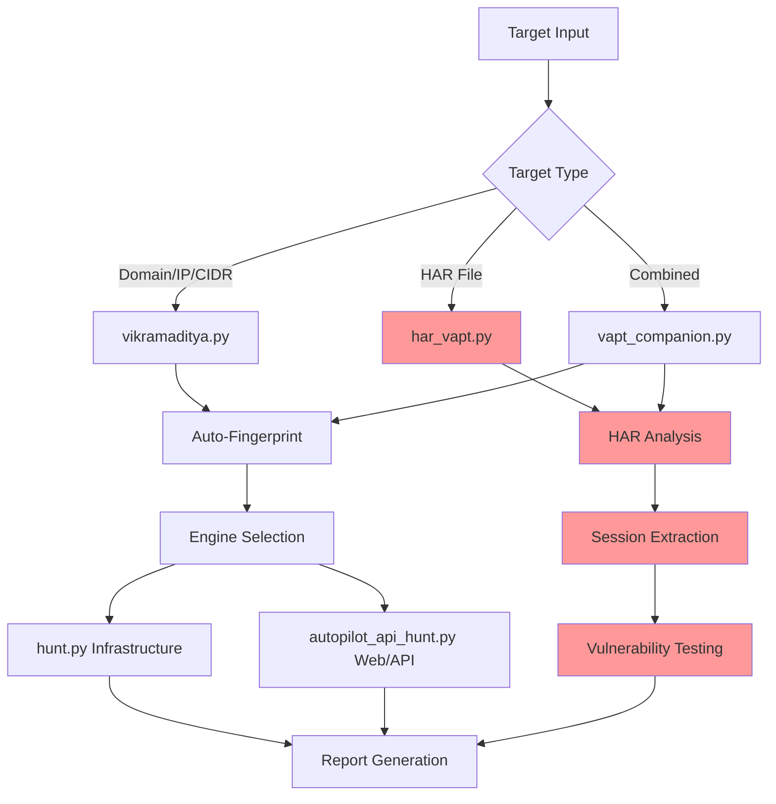

<div align="center">

```
 ██╗   ██╗██╗██╗  ██╗██████╗  █████╗ ███╗   ███╗ █████╗ ██████╗ ██╗████████╗██╗   ██╗ █████╗
 ██║   ██║██║██║ ██╔╝██╔══██╗██╔══██╗████╗ ████║██╔══██╗██╔══██╗██║╚══██╔══╝╚██╗ ██╔╝██╔══██╗
 ██║   ██║██║█████╔╝ ██████╔╝███████║██╔████╔██║███████║██║  ██║██║   ██║    ╚████╔╝ ███████║
 ╚██╗ ██╔╝██║██╔═██╗ ██╔══██╗██╔══██║██║╚██╔╝██║██╔══██║██║  ██║██║   ██║     ╚██╔╝  ██╔══██║
  ╚████╔╝ ██║██║  ██╗██║  ██║██║  ██║██║ ╚═╝ ██║██║  ██║██████╔╝██║   ██║      ██║   ██║  ██║
   ╚═══╝  ╚═╝╚═╝  ╚═╝╚═╝  ╚═╝╚═╝  ╚═╝╚═╝     ╚═╝╚═╝  ╚═╝╚═════╝ ╚═╝   ╚═╝      ╚═╝   ╚═╝  ╚═╝
```

**v6.4 — 229-test suite + sneaky_bits + /autopilot + /remember + /surface + recon-ranker + meme-coin + /intel + bb-methodology + credential store + /pickup + CI/CD + HackerOne MCP + CVSS 4.0 + HAR auth testing**

> *"He who seeks the truth must be ready to face the fire."*
> — inspired by the legend of Vikramaditya

[](LICENSE)
[](https://python.org)
[](https://www.gnu.org/software/bash/)
[](#multi-provider-ai)

[Quick Start](#quick-start) · [HAR-based Testing](#har-based-authenticated-testing) · [What's New in v4.1](#whats-new-in-v41) · [How It Works](#how-it-works) · [Architecture](#architecture) · [Vulnerability Coverage](#vulnerability-coverage) · [Reports](#reports) · [Installation](#installation) · [Contributing](#contributing)

---

**One target → Auto-fingerprint → Smart engine selection → AI writes exploit code → Professional report**

**🔥 NEW: HAR-based authenticated testing — Use real browser sessions for deep security testing**

</div>

---

## What's New in v4.1

### **🚀 HAR-Based Authenticated VAPT (New)**

| Feature | Description |
|:--------|:------------|
| **HAR File Support** | Load browser session data (HAR files) for authenticated testing |
| **Automatic Endpoint Discovery** | Extract all authenticated endpoints from captured browser traffic |
| **Session Token Analysis** | Automatically extract Bearer tokens, cookies, and API keys |
| **Deep Vulnerability Testing** | SQL injection, file upload RCE, auth bypass, IDOR, XSS with real sessions |
| **Attack Surface Mapping** | Identify admin panels, file uploads, APIs from actual usage patterns |
| **Comprehensive POC Scripts** | Ready-to-run proof-of-concept code for all vulnerability types |

### **Enhanced Platform Capabilities**

| Feature | v4.0 | v4.1 |
|:--------|:-----|:-----|
| **Testing Approach** | Infrastructure + unauthenticated web | + **HAR-based authenticated testing** |
| **Session Data** | Manual credential input | + **Browser session extraction** |
| **Endpoint Discovery** | Static JS analysis | + **Dynamic user interaction analysis** |
| **Vulnerability Testing** | Standard automated scans | + **Authenticated context testing** |
| **Admin Panel Testing** | External enumeration | + **Authenticated admin function testing** |
| **File Upload Testing** | Basic file upload detection | + **Real session file upload RCE testing** |
| **Integration** | Single platform | + **Standalone + integrated workflows** |

---

## HAR-Based Authenticated Testing

### **🎯 Capture Real Sessions**

```bash
# Step 1: Capture browser session
# 1. Open target app in browser
# 2. Open DevTools (F12) → Network tab
# 3. Login and navigate authenticated areas
# 4. Right-click → Save as HAR file

# Step 2: Run authenticated VAPT
python3 har_vapt.py admin_session.har
```

### **🔥 What HAR Testing Finds**

- **SQL Injection** — Authentication bypass in login forms
- **File Upload RCE** — Malicious file uploads in admin panels
- **Authentication Bypass** — Admin functions accessible without credentials
- **IDOR** — User enumeration and unauthorized data access
- **XSS** — Cross-site scripting in authenticated parameters
- **Session Management** — Token security and session hijacking

### **🛠️ HAR Testing Tools**

```bash
# Complete HAR-based VAPT workflow
python3 har_vapt.py session.har                # All-in-one testing

# Individual components
python3 har_analyzer.py session.har            # Extract endpoints & tokens
python3 har_vapt_engine.py session_analysis.json  # Run vulnerability tests

# Combined infrastructure + authenticated testing
python3 vapt_companion.py --full example.com   # Best of both approaches

# Interactive suite with all tools
python3 vapt_suite.py                          # Unified interface
```

### **📊 Real-World Results**

Recent HAR-based testing on email platform:
- **83 endpoints** discovered from browser session
- **49 vulnerabilities** found including:
  - 32 Critical (File upload RCE)
  - 6 High (Authentication bypass)
  - 11 Medium (Session management)
- **Bearer token extraction** and security analysis
- **Complete attack surface** mapped from real usage

---

## What's New in v2.0

| Feature | v1.x | v2.0 |
|:--------|:-----|:-----|
| **Entry point** | 5+ scripts with flags (`hunt.py --target x --full`) | `python3 vikramaditya.py` — one command, interactive |
| **Target detection** | Manual: pick the right script | Auto: fingerprints tech stack, login, API, routes to right engine |
| **Brain role** | Supervisor only (CONTINUE/SKIP/INJECT) | **Writes and executes exploit code** — PoCs, bypasses, code audits |
| **Fix verification** | Manual retest | `--verify-fix` mode: brain reads deployed code, finds logic flaws, writes bypasses |
| **Code audit** | Not available | `--audit-code` mode: feed source code, brain finds vulns and writes PoCs |
| **Endpoint discovery** | Single main.js bundle only | All JS chunks (Vite, Next.js, CRA), dynamic imports, OpenAPI/Swagger |
| **Login detection** | Required `--login-url` flag | Auto-detects from 18+ common patterns + dev/staging endpoints |
| **API base path** | Required `--base-url` flag | Auto-probes `/api/`, `/v1/`, subdomains, same-origin detection |
| **URL dedup** | No dedup (scans thousands of identical news/video URLs) | Pattern-based collapse: 5000 → 50 unique code paths |
| **Scope lock** | `--scope-lock` flag | Interactive prompt: "scan this exact host only?" |
| **CLI args** | Required (`--target x --full --with-brain`) | `python3 vikramaditya.py example.com` — one arg, everything auto |
| **Banner** | Orange gradient | Indian flag colors (saffron, white, green, Ashoka blue) |

---

## The Legend

**Vikramaditya** — the legendary Indian emperor whose throne could only be ascended by one who sought truth fearlessly and judged without bias. His name means *"valour of the sun"*.

This tool operates the same way. Give it a target. Walk away. Come back to a full VAPT report — every vulnerability exposed, every weakness catalogued.

It was inspired by and evolved from [**claude-bug-bounty**](https://github.com/shuvonsec/claude-bug-bounty) — the original AI-assisted bug bounty automation platform that laid the recon pipeline, ReAct agent architecture, and AI analysis engine that powers this tool today.

---

## What It Does

Vikramaditya is an autonomous VAPT tool built for professional security consultants. You give it a target — a domain, a single IP, or an entire subnet. It runs the full assessment pipeline and produces a submission-ready report.

| Stage | What happens |
|:------|:-------------|
| 🔭 **Recon** | Subdomain enumeration, DNS resolution, live host discovery, URL crawling, JS analysis, secret extraction |
| 🔬 **Fingerprint** | Tech stack detection (httpx), CVE risk scoring, priority host ranking |
| 🔍 **Scan** | SQLi, XSS, SSTI, RCE, file upload, CORS, JWT, cloud misconfigs, framework exposure |
| 💥 **Exploit** | CMS exploit chains (Drupal, WordPress), Spring actuators, exposed admin panels |
| 🧠 **Analyze** | AI-powered triage — finds chains, ranks by impact, kills noise |
| 📋 **Report** | Burp Suite-style HTML report: executive summary, CVSS scores, PoC evidence, remediation |
| 🔐 **HAR Testing** | **NEW**: Browser session analysis, authenticated vulnerability testing, real-world attack simulation |

---

## Quick Start

```bash
git clone https://github.com/venkatas/vikramaditya.git
cd vikramaditya
chmod +x setup.sh && ./setup.sh      # installs all required tools

# Download BugTraceAI brain (security-tuned, recommended)
wget -c 'https://huggingface.co/BugTraceAI/BugTraceAI-Apex-G4-26B-Q4/resolve/main/BugTraceAI-Apex-G4-26B-Q4.gguf' -O /tmp/BugTraceAI-Apex-G4-26B-Q4.gguf
ollama create bugtraceai-apex -f Modelfiles/BugTraceAI-Modelfile

# Or use stock Gemma4 (also works well)
ollama pull gemma4:26b               # fast all-rounder brain (17GB)
```

### The Only Command You Need

```bash
# Fully autonomous — zero prompts (when Ollama is installed)
python3 vikramaditya.py example.com
python3 vikramaditya.py https://app.example.com --creds "user@domain.com:password"
python3 vikramaditya.py 10.0.0.0/24

# NEW: HAR-based authenticated testing
python3 har_vapt.py admin_session.har

# Combined infrastructure + authenticated testing
python3 vapt_companion.py --full example.com

# With fix verification
python3 vikramaditya.py https://app.example.com --creds "user:pass" --verify-fix "CSRF fixed via ols token"
```

When Ollama is installed, **zero prompts** — brain drives everything:
- Auto-fingerprints, auto-selects engine, auto-enables brain + active scanner
- Auto-generates report when done
- Only asks for credentials if login detected and `--creds` not provided

Without Ollama, falls back to interactive mode with prompts.

### HAR Testing Workflow

```bash
# Interactive HAR testing
python3 vapt_suite.py

# Quick HAR analysis
python3 har_analyzer.py session.har

# Complete HAR VAPT
python3 har_vapt.py session.har

# Combined assessment
python3 vapt_companion.py --full target.com
```

It will:

1. Ask for a target (URL, domain, IP, CIDR, **or HAR file**)
2. Auto-fingerprint the target (tech stack, login pages, API endpoints, JS bundles, OpenAPI specs)
3. **NEW**: Analyze HAR files for authenticated endpoints and session data
4. Show a summary of what it found and recommend the right scan type
5. Ask for credentials if a login page is detected (password input is hidden)
6. Enable the AI brain automatically if Ollama is installed
7. Offer **brain active scanner** — LLM writes and executes exploit code, not just supervises
8. **NEW**: Offer **HAR-based authenticated testing** for deep vulnerability analysis
9. Offer **fix verification** — developer says "fixed"? Brain reads the code and finds bypasses
10. Route to the right scan engine and run the full assessment
11. Offer to generate a professional report at the end

```
$ python3 vikramaditya.py app.example.com

  ────────────────────────────────────────────────────────
    TARGET SUMMARY
  ────────────────────────────────────────────────────────
    Target  : https://app.example.com
    Status  : HTTP 200
    Tech    : Vite, React
    Login   : /auth/login
    API     : https://app.example.com/v1
    JS      : 52 bundles, 80+ API calls found
    OpenAPI : found

    Recommended: Authenticated API VAPT
  ────────────────────────────────────────────────────────

  Proceed? [Y/n]: y
  Do you have credentials? [Y/n]: y
  Username / email: admin@example.com
  Password: ********
  Second account for IDOR / privilege escalation testing? [y/N]: n
  AI brain supervisor: enabled. Keep enabled? [Y/n]: y
  Run brain active scanner? (LLM writes + executes exploit code) [y/N]: y
  Verify a developer's fix claim? [y/N]: n

  [launching 12-phase brain-supervised API VAPT...]
  [then brain active scanner writes + runs exploit PoCs...]
```

### HAR File Testing Example

```
$ python3 har_vapt.py admin_session.har

  ────────────────────────────────────────────────────────
    HAR ANALYSIS SUMMARY
  ────────────────────────────────────────────────────────
    Target Domain     : app.example.com
    Total Endpoints   : 127
    Admin Endpoints   : 18
    File Uploads      : 3
    High-Value Targets: 31
    Authentication    : bearer_token
    Bearer Token      : eyJ0eXAiOiJKV1QiLCJh...

    Recommended Tests : sql_injection, file_upload_rce, auth_bypass
  ────────────────────────────────────────────────────────

  🚀 Starting comprehensive VAPT scan...
  🧪 Testing SQL Injection...
  🚨 [CRITICAL] SQL Injection: Authentication bypass confirmed
  🧪 Testing File Upload RCE...
  🚨 [CRITICAL] File Upload RCE: 4 malicious files uploaded successfully
  🧪 Testing Authentication Bypass...
  🚨 [HIGH] Authentication Bypass: Admin panels accessible without auth

  📊 Found 23 vulnerabilities (8 Critical, 5 High, 10 Medium)
  💾 Results saved to: har_vapt_results_20240414_143022.json
```

---

## Core Architecture

<div align="center">



</div>

### **File Structure**

```
vikramaditya/
├── vikramaditya.py              # Main orchestrator (unchanged)
├── hunt.py                      # Infrastructure VAPT
├── autopilot_api_hunt.py        # Web/API VAPT  
├── har_analyzer.py              # 🔥 HAR file analysis
├── har_vapt_engine.py           # 🔥 HAR-based vulnerability testing
├── har_vapt.py                  # 🔥 Complete HAR VAPT workflow
├── vapt_companion.py            # 🔥 Combined infrastructure + HAR
├── vapt_suite.py                # 🔥 Interactive unified interface
├── brain_scanner.py             # AI exploit generation
├── reporter.py                  # HTML/PDF report generation
├── brain.py                     # AI analysis engine
├── agent.py                     # Autonomous ReAct agent
├── recon.sh                     # Subdomain enumeration
├── scanner.sh                   # Vulnerability scanning
└── poc_*.py                     # 🔥 Proof-of-concept scripts
```

---

## Vulnerability Coverage

### **Infrastructure Testing (Original)**

| Category | Tools | Techniques |
|:---------|:------|:-----------|
| **Recon** | subfinder, assetfinder, amass, httpx | Subdomain enumeration, live host discovery, tech fingerprinting |
| **Scanning** | nuclei, sqlmap, naabu, feroxbuster | CVE detection, SQL injection, port scanning, directory bruteforce |
| **Exploitation** | manual + brain-generated PoCs | CMS exploits, Spring Boot actuators, cloud misconfigs |

### **Authenticated Testing (New)**

| Category | Vulnerability Types | HAR-Based Testing |
|:---------|:-------------------|:------------------|
| **Injection** | SQL injection, NoSQL injection, Command injection | ✅ Authentication bypass, Parameter injection |
| **Broken Auth** | Session management, Authentication bypass | ✅ Admin panel access, Invalid session acceptance |
| **Sensitive Data** | IDOR, Information disclosure | ✅ User enumeration, Unauthorized data access |
| **File Upload** | RCE, Path traversal, Filter bypass | ✅ Malicious uploads, Bypass techniques |
| **XSS** | Reflected, Stored, DOM-based | ✅ Parameter-based testing |
| **Session** | Token security, Hijacking | ✅ Bearer token analysis, Cookie security |

### **AI-Powered Analysis**

- **Exploit Generation** — Brain writes custom PoC code for found vulnerabilities
- **Chain Discovery** — Identifies multi-step attack paths
- **False Positive Reduction** — AI triage removes noise
- **Fix Verification** — Reads deployed code, finds logic bypass opportunities
- **Impact Assessment** — Business risk scoring and prioritization

---

## Multi-Provider AI

| Provider | Models | Use Case |
|:---------|:-------|:---------|
| **Ollama** (Local) | BugTraceAI-Apex-G4, Gemma4, Llama3.1, Codestral | Primary brain, exploit generation, code analysis |
| **MLX** (Apple Silicon) | Gemma4-MLX, Llama3.1-MLX | Fast inference on M1/M2/M3 Macs |
| **OpenAI** | GPT-4o, GPT-4-Turbo | Premium analysis, complex reasoning |
| **Anthropic** | Claude 3.5 Sonnet, Claude 3 Opus | Code understanding, vulnerability research |
| **Google** | Gemini 1.5 Pro | Multimodal analysis, document processing |
| **xAI** | Grok-2 | Alternative reasoning, real-time knowledge |

Configure via environment variables or interactive setup.

---

## Reports

### **Professional VAPT Reports**

- **Executive Summary** — Business impact, risk scores, remediation timeline
- **Technical Findings** — Detailed vulnerability descriptions with PoC evidence
- **CVSS Scoring** — Industry-standard risk assessment
- **Remediation Guidance** — Step-by-step fix instructions
- **Compliance Mapping** — OWASP Top 10, CWE references

### **Output Formats**

```bash
# Generate HTML report
python3 reporter.py findings/ --client "Acme Corp" --consultant "Your Name"

# Multiple formats
python3 reporter.py findings/ --format html,pdf,json
```

Sample outputs:
- **HTML**: Burp Suite-style professional report
- **JSON**: Machine-readable findings for integration
- **PDF**: Executive presentation format
- **Markdown**: Documentation-friendly format

---

## Installation

### **Automated Setup**

```bash
git clone https://github.com/venkatas/vikramaditya.git
cd vikramaditya
chmod +x setup.sh && ./setup.sh
```

The setup script installs all required tools:
- **Core Tools**: httpx, subfinder, nuclei, sqlmap, naabu, feroxbuster
- **Python Dependencies**: requests, beautifulsoup4, selenium
- **AI Runtime**: Ollama (optional but recommended)

### **Manual Setup**

```bash
# Install Go tools
go install -v github.com/projectdiscovery/httpx/cmd/httpx@latest
go install -v github.com/projectdiscovery/subfinder/v2/cmd/subfinder@latest
go install -v github.com/projectdiscovery/nuclei/v3/cmd/nuclei@latest

# Install Python dependencies
pip install requests beautifulsoup4 selenium

# Install Ollama (for AI features)
curl -fsSL https://ollama.ai/install.sh | sh
ollama pull gemma4:26b
```

### **Docker Support**

```bash
docker build -t vikramaditya .
docker run -v $(pwd)/results:/app/results vikramaditya:latest example.com
```

---

## Professional Usage

### **VAPT Engagement Workflow**

1. **Scoping** — Define targets, obtain written authorization
2. **Reconnaissance** — `python3 vikramaditya.py target.com`
3. **Authenticated Testing** — Capture HAR files, run `python3 har_vapt.py session.har`
4. **Analysis** — AI-powered triage and impact assessment
5. **Reporting** — Generate client-ready reports
6. **Remediation Support** — Fix verification and retesting

### **Enterprise Features**

- **Multi-target scanning** — Subnet and domain range support
- **Authenticated testing** — HAR-based session analysis
- **Compliance reporting** — OWASP, NIST, ISO 27001 mapping
- **Integration APIs** — JSON output for SIEM/GRC platforms
- **Team collaboration** — Shared findings database

### **Quality Assurance**

- **False positive reduction** — AI-powered validation
- **Manual verification** — Security expert review process
- **Reproducible testing** — Detailed PoC documentation
- **Evidence collection** — Screenshots, request/response data

---

## Ethical Use & Legal Compliance

### **Authorization Requirements**

- ✅ **Only test systems you own or have explicit written permission to test**
- ✅ **Obtain proper documentation** before starting any assessment
- ✅ **Stay within defined scope** — use `--scope-lock` for strict boundaries
- ✅ **Follow responsible disclosure** for any findings

### **Professional Standards**

- **CERT-In empanelled** testing methodology
- **OWASP Testing Guide** compliance
- **NIST Cybersecurity Framework** alignment
- **ISO 27001** security controls validation

### **Data Protection**

- **HAR files contain session data** — handle securely
- **Encrypt sensitive findings** during storage and transmission
- **Follow data retention policies** for client information
- **Implement secure deletion** procedures post-engagement

---

## Contributing

We welcome contributions! Here's how to get involved:

### **Development**

```bash
# Fork the repository
git clone https://github.com/yourusername/vikramaditya.git
cd vikramaditya

# Create a feature branch
git checkout -b feature/new-testing-module

# Make your changes
# Add tests for new functionality
# Update documentation

# Submit a pull request
```

### **Contribution Areas**

- **New vulnerability testing modules**
- **Additional AI model integrations**
- **Enhanced reporting formats**
- **Performance optimizations**
- **Documentation improvements**
- **HAR analysis enhancements**

### **Code Standards**

- **Python 3.10+** compatibility
- **Type hints** for new functions
- **Comprehensive docstrings**
- **Unit tests** for critical functionality
- **Security-first design** principles

---

## License & Support

### **License**

MIT License - see [LICENSE](LICENSE) file for details.

### **Professional Support**

- 📧 **Email**: security@vikramaditya.dev
- 💬 **Discord**: [Join our community](https://discord.gg/vikramaditya)
- 📚 **Documentation**: [Full docs](https://docs.vikramaditya.dev)
- 🐛 **Issues**: [GitHub Issues](https://github.com/venkatas/vikramaditya/issues)

### **Enterprise Licensing**

Commercial licenses available for:
- **White-label deployments**
- **Custom integrations**
- **Professional training**
- **Extended support contracts**

---

## Security Notice

This tool is designed for authorized security testing only. The developers assume no liability for misuse. Always ensure you have explicit permission before testing any systems.

**Professional Security Consulting**: If you need expert VAPT services, our team of CERT-In empanelled consultants is available for engagements.

---

<div align="center">

**Built with ❤️ for the cybersecurity community**

*Inspired by the legend of Emperor Vikramaditya — fearless pursuit of truth*

**[⭐ Star this project](https://github.com/venkatas/vikramaditya)** if it helps secure your applications!

</div>