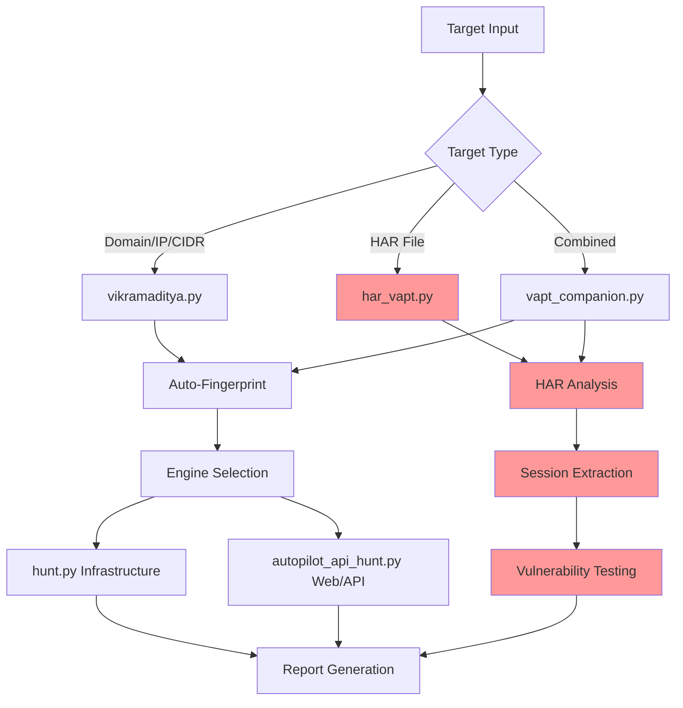

<div align="center">

```
 ██╗   ██╗██╗██╗  ██╗██████╗  █████╗ ███╗   ███╗ █████╗ ██████╗ ██╗████████╗██╗   ██╗ █████╗
 ██║   ██║██║██║ ██╔╝██╔══██╗██╔══██╗████╗ ████║██╔══██╗██╔══██╗██║╚══██╔══╝╚██╗ ██╔╝██╔══██╗
 ██║   ██║██║█████╔╝ ██████╔╝███████║██╔████╔██║███████║██║  ██║██║   ██║    ╚████╔╝ ███████║
 ╚██╗ ██╔╝██║██╔═██╗ ██╔══██╗██╔══██║██║╚██╔╝██║██╔══██║██║  ██║██║   ██║     ╚██╔╝  ██╔══██║
  ╚████╔╝ ██║██║  ██╗██║  ██║██║  ██║██║ ╚═╝ ██║██║  ██║██████╔╝██║   ██║      ██║   ██║  ██║
   ╚═══╝  ╚═╝╚═╝  ╚═╝╚═╝  ╚═╝╚═╝  ╚═╝╚═╝     ╚═╝╚═╝  ╚═╝╚═════╝ ╚═╝   ╚═╝      ╚═╝   ╚═╝  ╚═╝
```

**v9.17.0 — Lifecycle / EOL checker (endoflife.date) (2026-05-09)**

New `eol_check.py` — wraps the public **[endoflife.date](https://endoflife.date/)** metadata API and produces a per-engagement `recon/<target>/eol.md` flagging EOL'd / near-EOL / supported software for every detected tech (~80 fingerprint→slug mappings). Auto-invoked from `intel.py`, so every `intel.md` now leads with a "Lifecycle / End-of-Life Status" block — gives PCI-DSS 6.2 / ISO 27001 A.12.6.1 evidence on tap. Cached at `~/.cache/vikramaditya/eol/<slug>.json` (24h TTL); degrades to `status: no_data` on outage.
```bash
# Standalone — supply detected tech (versions optional, with =version)
python3 eol_check.py --tech "asp.net,iis,dotnetfx=4.8,php=5.6" \
                     --target client-portal.example.com \
                     --json recon/<target>/eol.json
# Show fingerprint→slug map / bust 24h cache
python3 eol_check.py --list-products
python3 eol_check.py --refresh --tech "ubuntu=20.04"
```
**Credits.** Lifecycle data courtesy of [endoflife.date](https://endoflife.date/) ([github.com/endoflife-date/endoflife.date](https://github.com/endoflife-date/endoflife.date), MIT-licensed). Credit string is embedded automatically in every `eol.md` and the lifecycle block of `intel.md` — please retain when redistributing client-facing reports.

See [CHANGELOG.md](CHANGELOG.md#v9170).

---

**v9.16.0 — Brain LLM bake-off harness (2026-05-06)**

New `brain_model_bench.py` — replays `brain.py scan` against the same findings dir using each candidate Ollama model and ranks by **hallucination rate** (SUBMIT verdicts that target sqlmap-flagged false-positive URLs). Replaces swap-and-pray with deterministic ground-truth benching.
```bash
python3 vikramaditya.py --brain-model-bench \
    --bmb-findings findings/pranapr.com/sessions/<id> \
    --bmb-recon    recon/pranapr.com/sessions/<id>
# or watch-and-auto-fire after a long run completes:
python3 brain_model_bench.py --watch-log <runner.log> --watch-pattern "==== END" \
    --findings-glob "findings/<target>/sessions/2026*" \
    --recon-glob    "recon/<target>/sessions/2026*"
```
See [CHANGELOG.md](CHANGELOG.md#v9160).

---

**v9.15.0 — Brain benchmark vs Buttercup (DARPA AIxCC) (2026-05-05)**

`brain_benchmark.py` — head-to-head vs Trail of Bits' Buttercup. CSV log tracks capability drift as Ollama models update.
```bash
python3 vikramaditya.py --brain-bench https://example.com \
    --brain-bench-recon recon/example.com/sessions/<id>
python3 vikramaditya.py --brain-bench-integrate
```
See [CHANGELOG.md](CHANGELOG.md#v9150).

---

**v9.14.0 — Deep SAST (CodeQL + Bearer) (2026-05-05)**

`sast_audit.py` — semantic taint-tracking (CodeQL, 10 languages) + PII flow (Bearer for DPDP/GDPR).
```bash
python3 vikramaditya.py --sast path/to/repo --sast-language python,javascript
```
See [CHANGELOG.md](CHANGELOG.md#v9140).

---

**v9.13.0 — GraphQL DAST bundle (graphw00f + Clairvoyance + InQL) (2026-05-05)**

`graphql_audit.py` — engine fingerprinting + introspection-disabled schema reconstruction + auto-query generation.
```bash
python3 vikramaditya.py --graphql https://api.client.com/graphql --header "Authorization: Bearer $TOK" --graphql-clairvoyance
```
See [CHANGELOG.md](CHANGELOG.md#v9130).

---

**v9.12.0 — Microsoft RESTler stateful REST API fuzzer (2026-05-05)**

`restler_audit.py` — infers producer-consumer dependencies from OpenAPI; reaches deep states stateless tools can't.
```bash
python3 vikramaditya.py --restler openapi.json --restler-base-url https://api.client.com --restler-time-h 4
```
See [CHANGELOG.md](CHANGELOG.md#v9120).

---

**v9.11.0 — WAF / anti-bot bypass toolkit (2026-05-05)**

`waf_bypass.py` — padding (nowafpls-style), URL mangling (bypass-url-parser), FireProx IP rotation.
```bash
python3 vikramaditya.py --waf-bypass https://target.com/admin --waf-mangle
```
See [CHANGELOG.md](CHANGELOG.md#v9110).

---

**v9.10.0 — LLM red-teaming (Garak + PyRIT + Promptfoo) (2026-05-05)**

`llm_hunt.py` — every B2B SaaS now ships AI features. Garak for breadth, PyRIT for depth, Promptfoo for CI regression.
```bash
python3 vikramaditya.py --llm-hunt https://api.client.com/chat --llm-auth 'Authorization: Bearer $TOK'
```
See [CHANGELOG.md](CHANGELOG.md#v9100).

---

**v9.9.0 — IaC dedicated scanner (Checkov + KICS) (2026-05-05)**

`iac_audit.py` — deeper than Trivy config. Checkov graph-based + KICS Rego policies.
```bash
python3 vikramaditya.py --iac-deep path/to/terraform --iac-frameworks terraform,kubernetes
```
See [CHANGELOG.md](CHANGELOG.md#v990).

---

**v9.8.0 — Kubernetes audit (Kubescape + Trivy + Falco) (2026-05-05)**

`k8s_audit.py` — Kubescape posture (NSA/CISA/MITRE), Trivy cluster + image + IaC, Falco eBPF runtime.
```bash
python3 vikramaditya.py --k8s-audit client-prod --k8s-framework nsa --k8s-trivy-images
```
See [CHANGELOG.md](CHANGELOG.md#v980).

---

**v9.7.0 — Active Directory / hybrid identity (NetExec + BloodHound CE + Impacket + Certipy) (2026-05-05)**

New `ad_hunt.py`. NetExec replaces dead CME; BloodHound CE for graph attack-paths; Certipy for ADCS ESC1-ESC15.
```bash
python3 vikramaditya.py --ad-hunt corp.client.local --ad-dc 10.1.1.10 \
    --ad-user audit_user --ad-pass 'P@ss' --ad-mode all
```
See [CHANGELOG.md](CHANGELOG.md#v970).

---

**v9.6.0 — Mobile VAPT (MobSF + Frida + Objection + Drozer) (2026-05-05)**

New `mobile_hunt.py`. Closes the biggest scope gap — clients asking "do you do mobile?" no longer gets a no.
```bash
docker run -d -p 8000:8000 opensecurity/mobile-security-framework-mobsf
export MOBSF_API_KEY=<key>
python3 vikramaditya.py --mobile app.apk
```
See [CHANGELOG.md](CHANGELOG.md#v960).

---

**v9.5.0 — ProjectDiscovery tool integration bundle: 8 tools wired (2026-05-05)**

5 PD binaries were already in `~/go/bin` but never invoked; 3 more installed in seconds. v9.5.0 wires all 8 into the appropriate phase.

| Tool | Phase | Effect |
|---|---|---|
| **cvemap** | `intel.py` (preferred CVE source) | KEV / public-PoC / EPSS metadata; falls back to GHSA + NVD without PDCP key |
| **cdncheck** | `recon.sh` Phase 3 | `live/cdn_map.json` tags Cloudflare/Akamai/CloudFront/Fastly/Azure FD edges |
| **fingerprintx** | `recon.sh` after naabu | `ports/fingerprintx.json` — RDP/SSH/SMB/Postgres/Mongo auth-protocol detection |
| **asnmap** | `classify_target()` | NEW `AS<num>` target type → expand to CIDRs, iterate hunt.py |
| **mapcidr** | `expand_cidrs()` helper | CIDR-to-IP expansion with `max_hosts=65536` safety cap |
| **shuffledns** | `recon.sh` Phase 1 | Wildcard-aware mass DNS resolve before Phase 3 httpx |
| **notify** | `brain.py auto_triage_and_exploit` | Slack/Discord/Teams/Telegram ping on SUBMIT verdicts |
| **cloudlist** | `--cloudlist` flag | Multi-cloud asset listing (AWS/Azure/GCP/DO/Hetzner/Linode) |

```bash
python3 vikramaditya.py AS13335                # ASN target — asnmap expands, hunt iterates
python3 vikramaditya.py --cloudlist            # multi-cloud asset enum
PDCP_API_KEY=... python3 intel.py --tech jquery,iis,aspnet --target X
```

See [CHANGELOG.md](CHANGELOG.md#v950) for full per-tool wiring details.

---

**v9.4.0 — Tier-1 power-up bundle: mindmap + intel + oauth + race + cicd wired (2026-05-05)**

Five upstream tools (`mindmap.py`, `intel.py`, `oauth_tester.py`, `race_audit.py`, `cicd_scanner.sh`) shipped in the initial release as orphan scripts but were never wired into the orchestrator. v9.4.0 adapts them for VAPT framing and integrates each into `vikramaditya.py`.

| Tool | When | Flag |
|---|---|---|
| `mindmap.py` | Phase 0b stub + post-fingerprint refresh | `--skip-mindmap` |
| `intel.py` | Auto-fetches GHSA + NVD CVEs after fingerprint | `--intel` (auto in autonomous) |
| `oauth_tester.py` | Operator-driven OAuth/OIDC audit | `--oauth-audit URL` |
| `race_audit.py` (NEW) | Operator-driven threaded race tester | `--race-test URL --race-threads N --race-method M --race-body JSON --header "K: V"` |
| `cicd_scanner.sh` | Operator-driven GitHub Actions audit | `--cicd-audit OWNER/REPO` |

Adaptation highlights: `mindmap.py` had 50+ `bug-bounty-hunt → X` references replaced with concrete Vikramaditya tool paths and gained a `generate()` importable function for reporter.py. `race_audit.py` is a brand-new 240-line generic threaded tester (the upstream `race.py` was 100% HackerOne GraphQL API tests). `oauth_tester.py` was already generic in the repo, just got a wrapper. The H1-specific `race.py` and `oauth.py` remain for archive but are no longer invoked.

```bash
python3 vikramaditya.py adfactorspr.com           # mindmap + intel auto-run in autonomous
python3 vikramaditya.py --oauth-audit https://login.adfactorspr.com/oauth/authorize
python3 vikramaditya.py --race-test https://example.com/api/redeem \
    --race-method POST --race-body '{"code":"WELCOME10"}' --race-threads 30
python3 vikramaditya.py --cicd-audit "org:adfactors-pr"
python3 intel.py --tech "iis,aspnet,jwt,sitefinity" --target adfactorspr.com
```

See [CHANGELOG.md](CHANGELOG.md#v940) for full wiring details and per-tool adaptation notes.

---

**v9.3.0 — Passive recon: Google dork catalogue (2026-05-05)**

Added a Phase-0 passive recon step. New `dorks.py` (adapted from `shuvonsec/claude-bug-bounty` MIT) renders a clickable HTML+JSON+TXT catalogue of search-engine queries that surface common engagement-relevant exposures — `.env` files, admin panels, PII spreadsheets, M365 tenant SAML metadata, leaked compliance PDFs, CI runbooks. No traffic is issued from the host; every query is a `https://www.google.com/search?q=...` URL the operator clicks through after confirming scope.

- **13 categories** (124 dorks in `all`): `credentials`, `pii` (incl. Aadhaar/PAN for Indian engagements), `admin`, `errors`, `cloud`, `subdomains`, `params`, `leaks`, `github`, `juicy`, **`microsoft365`** (tenant enum, SharePoint, Power BI, OneDrive/Teams), **`compliance`** (leaked ISO/PCI/SOC2 PDFs, runbooks, IR docs).
- **`vikramaditya.py --passive-only`** — generate the dork catalogue and exit. Use during the scoping call before active SOW signing.
- **`vikramaditya.py --skip-passive`** — old behaviour. Default now runs Phase 0 automatically for `domain`/`url` targets.

```bash
python3 dorks.py --list                              # 13 categories
python3 dorks.py -d adfactorspr.com                  # all → recon/<target>/sessions/<id>/passive/
python3 dorks.py -d adfactorspr.com -c microsoft365  # M365 tenant queries only
python3 vikramaditya.py adfactorspr.com --passive-only
```

See [CHANGELOG.md](CHANGELOG.md#v930) for the full category list and rationale.

---

**v9.2.0 — Engagement-driven fix bundle: 12 issues from full-sweep retro (2026-05-05)**

Drove a full Vikramaditya sweep across 3 client domains + 2 AWS profiles in one shot. Wall time 4h 39m. Surfaced 12 issues, all fixed in this release. Highlights:

- **P0-1**: cloud audit no longer skipped when two targets share an AWS profile (was silently leaving an empty `cloud/<acct>/` for the second target). Cached `cloud/` is now symlinked into the second target's tree so reporter.py keeps working. Also closed the bare-domain branch hole that bypassed whitebox entirely when HTTPS apex returned 0/error.
- **P0-2**: `pmapper` now ships a 14-region safe-list as the default `--include-regions` value — no more `me-south-1` ConnectTimeoutError out of the box. Override with `PMAPPER_REGIONS=...`.
- **P0-3**: brain triage no longer rationalises sqlmap's own "false positive or unexploitable" rows as `[UNKNOWN]`; they're dropped at the candidate-collection layer.
- **P0-4**: `recon.sh` resolves an absolute path to ProjectDiscovery `httpx` by checking each candidate binary's `-version` banner. Fixes the Python httpx (`/opt/homebrew/bin/httpx`) shadow that produced 0 live hosts in manual recon delta runs.
- **P1-5**: `vikramaditya.py` launches `hunt.py` with `python3 -u` + `PYTHONUNBUFFERED=1` so phase markers flush in real time under `nohup`.
- **P1-6**: WordPress detection now requires body-content proof (`wp-content`/`wp-includes`/`wordpress` markers, or wp/v2 namespace JSON) before staging the auto-Metasploit `wp_admin_shell_upload`. Closes the false-positive that ran admin:admin against an IIS+ASP.NET apex behind Cloudflare.
- **P1-7**: DNS wildcard early-detect — 3 random labels probed under the apex; if 2+ resolve, sets `WILDCARD_DNS=1`, writes `subdomains/wildcard_dns.json`, and Phase 2 drops every brute-forced candidate that resolves to the wildcard IP.
- **P2-8**: `whitebox/cloud_hunt.py --secrets-mode={heuristic,exhaustive}` flag. Heuristic stays default; exhaustive scans every bucket and every log group regardless of name.
- **P2-10**: brain 7-Question-Gate intermediate worksheets now persist to `findings/<domain>/sessions/<sid>/brain/gate_workings.md` instead of polluting the main log.
- **P3-11**: `logs/vikram_runs.csv` (one row per invocation: started, ended, duration, target, exit, version).
- **P3-12**: `recon/<domain>/cloud/<acct>/severity_rollup.json` precomputed per-phase severity counts.

```bash
# Exhaustive secrets sweep (compliance audits)
python3 -m whitebox.cloud_hunt --profile adf-pranapr \
    --allowlist pranapr.com --secrets-mode exhaustive \
    --session-dir recon/pranapr.com

# Engagement-time sweep wall-clock log
cat logs/vikram_runs.csv
```

See [CHANGELOG.md](CHANGELOG.md#v920) for the full list and rationale per item.

---

**v9.1.4 — phi4:14b promoted to primary brain + env-overridable model selection**

A/B comparison run on 03 May 2026 (kalki.pranapr.com, same args, parallel) confirmed `phi4:14b` strictly dominates `gemma4:26b` on output utility:
- phi4:14b produced all 4 brain analysis files (8,131 B total) including chain-candidates, manual-testing queue, H1 report stub
- gemma4:26b produced only 2 brain files (5,274 B total); brain phase 02 punted with "No findings — nothing to interpret." and skipped exploit-chain + report phases entirely
- phi4:14b was 4× faster on triage (4.3s vs 16.1s) and 3× faster on reasoning (7.4s vs 22.0s)
- gemma4:26b silently consumes all `num_predict` tokens on internal reasoning at default settings — produces empty responses with `done_reason=length` (likely caused silent truncation in production scans before this fix)

**New env overrides:** `BRAIN_MODEL=<name>` and `TRIAGE_MODEL=<name>` — used for per-engagement model swap and A/B testing without code edits.

```bash
BRAIN_MODEL=phi4:14b TRIAGE_MODEL=phi4:14b python3 hunt.py --target X
BRAIN_MODEL=deepseek-r1:14b python3 hunt.py --target X   # for deeper reasoning
```

Memory savings: gemma4:26b 17 GB → phi4:14b 9.1 GB = 8 GB freed during scans.

---

**v9.1.2/v9.1.3 — reporter.py 8-bug fix + brain.py model promotion**

Discovered while monitoring v9.1.1 e2e validation run on adfactorspr.com:
- Bug 1 (97-FP storm): reporter.py treated `upload/auth_required.txt` and similar scanner.sh state files as confirmed findings. A site that returned 403 on `/upload`, `/upload.php` etc. produced 97 fake "Unrestricted File Upload" HIGHs in the report. `NON_FINDING_FILES` + `NON_FINDING_PREFIXES` exclude lists added.
- Bug 2: `cve_database_matches.json` schema is dict-with-`cves_found`-array; reporter expected bare list. Now normalises both.
- Bug 3: `cves_custom/` subdir (P2 added) wasn't registered. Added Method 1c loader.
- Bugs 4–8: `KeyError 'raw'` on synthetic findings, `KeyError 'unknown'` on non-standard severities, host points at NVD instead of target, template title overwrites real title, CVSS hardcoded to severity bucket.

Net: pre-fix → 0 findings + 97-FP storm. Post-fix → 45 real findings with proper CVE IDs, correct hosts, per-CVE CVSS scores.

`brain.py` v9.1.3: MODEL_PRIORITY[0] swap to `phi4:14b` based on benchmark (see v9.1.4 above).

---

**v9.1.1 — P2 hardening: Zimbra CVE template + MFA hardware check**

- Custom nuclei template for **CVE-2025-68645 Zimbra LFI** (`nuclei-templates/cve-2025-68645-zimbra.yaml`), wired into `scanner.sh` as Check 1.5 with `CUSTOM_NUCLEI_TEMPLATES` env override.
- IAM MFA hardware-vs-virtual distinction (`whitebox/audit/mfa_hardware_check.py`) — flags virtual MFA as MEDIUM (CIS 1.6), root virtual MFA as CRITICAL (CIS 1.5); fail-soft.
- `.gitignore` additions for engagement scratch (parse_docs.py, schemathesis-report/, .claude/scheduled_tasks.lock, etc.).
- `burp_cli/burp_rescan.sh` — removed hardcoded API key; added `require_burp_key()` guard.

---

**v9.1.0 — Engagement-driven hardening: Prowler FP filter + WAF-COUNT detector + HAR-replay differential + NoSQL/Next.js probes + SSL strict-by-default**

Eight surgical fixes shipped after a 4-day live VAPT engagement, triple-verified (two independent agents + Codex GPT-5.5 review).

**P0 (5 fixes):** SSL `verify=False` purge — 25 sites strict-by-default with `VAPT_INSECURE_SSL=1` env opt-out (Semgrep ERRORs 25 → 0); Prowler false-positive filter (`whitebox/audit/fp_filter.py`) re-verifies RDS-snapshot-public, S3-write-public, Lambda-public-policy via boto3 before emitting findings; `recon.sh` dnsx step removed (was hanging 30+ min); ProjectDiscovery binaries pinned via `~/go/bin/` to dodge Python httpx PATH conflict.

**P1 (3 fixes):** WAF-COUNT-mode check (`whitebox/audit/waf_count_check.py`) — Prowler 4.5 doesn't flag rules in `Action.Count`; HAR-replay differential phase (`whitebox/har_replay.py`) — operator-injection probes per JSON parameter via `--har-file`; session config-lock (`whitebox/config_lock.py`) — tool versions + wordlist sha256 + env vars per session for reproducibility.

**New modules:** `whitebox/nosql_probe.py` (7-probe differential NoSQLi detector — distinguishes type-confusion from real operator-injection), `whitebox/nextjs_bypass.py` (CVE-2025-29927 X-Middleware-Subrequest probe with buildId discovery + protected-route enum), `burp_cli/burp_rescan.sh` (Burp Pro REST API wrapper for headless scan workflows).

---

**v9.0.0 — Greybox enrichment: TLS SAN harvest + visual recon + scope auto-suggest + SG description round-trip**

First batch of the v9.0 backlog landed (4 of 15 items: P11, P15, P22, P23).
- **Phase 3.5 TLS SAN harvest** in `recon.sh` — `tlsx -san -cn` finds adjacent client domains via cert SANs (engagement-validated: surfaced `merryspiders.com` in 60 sec where subfinder + amass + assetfinder produced 0).
- **Phase 4.5 Visual recon** in `recon.sh` — `gowitness scan file` captures rendered-DOM titles + screenshots (engagement-validated: corrected the misclassification of UNI5 HRMS as "Apache default install page").
- **SG `Description` round-trip** in `whitebox/exposure/analyzer.py` — operator intent strings ("Mongo DB" tag on the SG ingress) now flow into findings.
- **Route 53 → blackbox scope auto-suggest** in `whitebox/correlator/scope_suggest.py` — `cloud_hunt` now emits `scope-suggestion.json` listing every client-owned domain reachable from the audited account (Route53 zones + CloudFront aliases + internet-facing ELB DNS + LB product names). The same engagement found 5 client-owned domains via this pattern manually.

Whitebox test suite: **153 passing** (+11), 4 smoke skipped, 0 failures.

**v8.1.0 — Engagement-driven backlog (P10–P24) + tool-list expansion**

The whitebox AWS audit + dual-track operation introduced in v8.0.0 stays unchanged.
This release adds an engagement-validated backlog of 15 tool-improvement items
([`docs/superpowers/backlog/2026-05-01-engagement-driven-tool-gaps.md`](docs/superpowers/backlog/2026-05-01-engagement-driven-tool-gaps.md))
covering JS endpoint mining, TLS SAN harvesting, greybox correlation, email security
audit, visual recon, DB protocol probes, SPA-catchall false-positive suppression,
and Route53 → blackbox scope auto-suggest. Each item is anchored to a real finding
the v8.0 pipeline missed, false-positived, or required manual extraction on.

**v8.0.0 — Dual-track VAPT: Blackbox engine + Whitebox AWS audit, unified correlator, single report**

Give it a target. It picks the right engine — recon/fuzz/scan from the outside, or `cloud_hunt` from the inside (Prowler + PMapper + secrets correlator) — and feeds findings through the same correlator into the same Burp-style HTML report. The whitebox layer adds CIS / SOC2 / HIPAA / FedRAMP / FFIEC compliance evidence, IAM blast-radius graphs, and Lambda-environment / S3 / CloudWatch-Logs / SSM / SecretsManager / EC2-userdata secret scanning. v8 stays compatible with everything v7 added — engagement-privacy proxy, HAR auth replay, meme-coin module, HackerOne MCP, anonymization vault.

> *"He who seeks the truth must be ready to face the fire."*
> — inspired by the legend of Vikramaditya

[](LICENSE)
[](https://python.org)
[](https://www.gnu.org/software/bash/)
[](#multi-provider-ai)

[Quick Start](#quick-start) · [What's New in v8.1](#whats-new-in-v81) · [What's New in v8.0](#whats-new-in-v80) · [Whitebox AWS Audit](#whitebox-aws-audit-v80) · [Engagement Privacy](#engagement-privacy-v70v71) · [HAR-based Testing](#har-based-authenticated-testing) · [Architecture](#architecture) · [Vulnerability Coverage](#vulnerability-coverage) · [Reports](#reports) · [Installation](#installation) · [Contributing](#contributing)

---

**One target → Auto-fingerprint → Smart engine selection → AI writes exploit code → Professional report**

**🔥 NEW in v8.0: Whitebox AWS audit (Prowler + PMapper + secrets correlator) feeds the same report.**

</div>

---

## What's New in v8.1

A docs-only release filed after a four-day live VAPT engagement (29 Apr – 1 May 2026) against two AWS accounts and seven client domains. Every item below is anchored to a real finding the v8.0 pipeline either missed, false-positived, or required manual extraction on.

### Backlog highlights (P10 – P24)

| # | Gap | Why it matters | Effort |
|:--|:----|:---------------|:-------|
| **P10** | JS endpoint mining for Next.js / Vite / Angular bundles | Hidden subdomains in modern SPAs (engagement found two `*-gateway.example.com` hosts only by `grep` on Next.js chunks) | M |
| **P11** | TLS SAN harvesting (`tlsx` integration) | Surfaced an additional client domain in 60 sec | S |
| **P12** | Greybox correlator (whitebox cloud assets → blackbox seed) | 70 of 81 cloud-known IPs were invisible to pure DNS recon | M |
| **P13** | Email security audit module (DMARC / MTA-STS / TLS-RPT / DNSSEC) | Currently raw `dig` — DMARC misconfiguration was a top-3 finding | M |
| **P14** | Reachability verification on every exposure finding | 60% Critical-rate overstatement without it | M |
| **P15** | Visual recon (`gowitness`) | Caught a misclassification of an HRMS app as "Apache default page" | S |
| **P16** | DB-protocol probe library (MongoDB OP_MSG, Redis INFO, …) | Three-tier severity on DB ports (filtered / open-with-auth / open-without-auth) | M |
| **P17** | `bbot` wrapper as alternative recon engine | Modular multi-source enum supersets `recon.sh` | M |
| **P18** | S3 bucket-policy capture in findings | Verbatim policy quote needed for AWS-team remediation | XS |
| **P19** | SPA-catchall false-positive suppression in exposure module | 87 false positives across two engagements (kalki + mtrack patterns) | XS |
| **P20** | wpscan via Docker fallback | Homebrew wpscan has Bundler/Ruby gem-path issue on macOS | XS |
| **P21** | External `cloud_enum` integration | Shadow-IT bucket detection from outside | S |
| **P22** | SG rule `Description` round-trip | Operator-intent string leaks into findings (better report tone) | XS |
| **P23** | Route 53 → blackbox scope auto-suggest | Engagement scope was 2 domains; Route 53 held 5 more in the same account | S |
| **P24** | False-positive memory DB | Same false positive rediscovered three days running | S |

Detail: [`docs/superpowers/backlog/2026-05-01-engagement-driven-tool-gaps.md`](docs/superpowers/backlog/2026-05-01-engagement-driven-tool-gaps.md).

### Tooling that should ship pre-installed in v9.0

`bbot`, `tlsx`, `alterx`, `shuffledns`, `massdns`, `dnsgen`, `fingerprintx`, `xnLinkFinder`, `noseyparker`, `cloud_enum`, `gowitness`, `subzy`, `subjack`, `wpscan-via-docker`, plus the existing ProjectDiscovery base (`subfinder`, `dnsx`, `httpx`, `katana`, `naabu`, `nuclei`, `ffuf`).

---

## What's New in v8.0

| Pillar | What it does |
|:-------|:-------------|
| **`whitebox/cloud_hunt.py`** | Authenticated AWS audit. Iterates account-wide inventory (26 services × enabled regions), runs Prowler full-checks suite (~380 controls, OCSF JSON + CIS 1.4 / 1.5 / 2.0 / 3.0 / SOC2 / HIPAA / FedRAMP / FFIEC / GxP / AWS-FSBP / AWS-Well-Architected compliance CSVs), builds the PMapper IAM blast-radius graph (privesc paths, admin-reachability), scans secrets across Lambda env vars / SSM / SecretsManager / EC2 user-data / CloudWatch-Logs / S3 (with brain-driven or heuristic bucket selection so the scan finishes in minutes not hours), and emits a normalized correlator-ready findings dump. |
| **Region-aware by default** | `ec2 describe-regions` filtered to opt-in-status in (`opt-in-not-required`, `opted-in`) — unenabled opt-in regions never enter the iteration set, so boto3 doesn't hang in SYN_SENT against `me-south-1` / `af-south-1`. Override via `WHITEBOX_REGIONS=us-east-1,ap-south-1,eu-west-1`. |
| **Isolated-venv tool discovery** | Prowler 4.5 hard-pins `pydantic 1.10.18` (incompatible with `ollama` and most other deps in the main venv); PMapper 1.1.5 has its own dependency cluster. Whitebox discovers both binaries via env override → standard venv paths → `$PATH`. Lifts the typical pain of running CIS-grade audit tools alongside an LLM agent in one repo. |
| **macOS / Linux storage path support** | PMapper's graph storage on macOS lives under `~/Library/Application Support/com.nccgroup.principalmapper/`, not `~/.principalmapper/`. Wrapper handles both, plus Linux XDG paths and `/var/lib/principalmapper`. |
| **Configurable phase timeouts** | `PROWLER_TIMEOUT` (default 5400s) and `PMAPPER_TIMEOUT` (default 1800s) — large IAM estates and full-scope Prowler scans now extend cleanly without source edits. |
| **Per-phase atomic manifest** | Every phase reports `complete` or `failed` with `completed_at` and `artifacts`. Re-runs without `--refresh` skip cached fresh phases (24h TTL); `--refresh` busts everything. Failed phases auto-retry on the next invocation. |
| **Correlator hand-off** | Cloud assets (EC2, S3, Route53) are written as a per-account `asset_feed_<account>.json` and merged across accounts into `asset_feed.json` so blackbox findings on `203.0.113.42` get cloud context (instance ID, IAM role, SG posture, bucket public-access state) inline in the final report. |
| **Scope-lock by allowlist** | Route53 zones in the audited account are intersected with `--allowlist <domain>` before being treated as in-scope; `--no-scope-lock` is required to audit every zone. Prevents the engagement-creep pattern of "I audited this account, look what I found in their other domain." |
| **142-test whitebox suite** | Unit + integration coverage of every phase, plus optional smoke (`WHITEBOX_SMOKE=1`) against real AWS profiles for end-to-end validation. |

### Why dual-track matters

Blackbox tests like a real attacker (no credentials, perimeter-only). Whitebox tests like an authorized cloud auditor (read-only IAM credentials, account-wide visibility). They surface different bug classes:

- Blackbox finds: open ports, default IIS pages, SSRF, IDOR, public S3 with the right key guess.
- Whitebox finds: orphan SG rules, IAM privesc graphs, leaked secrets in Lambda env vars, missing CIS controls, GuardDuty findings going to a void, root MFA misconfig, CloudTrail / KMS gaps.

Run them together, and the correlator surfaces the chains: "the public-Internet host you found is in a VPC peered to PROD, runs as an IAM role with `iam:AttachRolePolicy`, and the Lambda next door has an AWS access key in its env vars." That chain is invisible to either tool alone.

### Whitebox AWS Audit (v8.0)

```bash
# Run alongside a blackbox engagement (vikramaditya.py auto-detects from whitebox_config.yaml)
python3 vikramaditya.py example.com

# Standalone whitebox-only run, single AWS profile
python3 -m whitebox.cloud_hunt --profile client-erp \
    --allowlist example.com \
    --session-dir recon/example.com

# Multi-account run with all timeouts widened for a large IAM estate
PROWLER_TIMEOUT=7200 PMAPPER_TIMEOUT=3600 \
WHITEBOX_REGIONS=us-east-1,ap-south-1,eu-west-1 \
python3 -m whitebox.cloud_hunt \
    --profile client-erp --profile client-data \
    --allowlist example.com --allowlist example-data.invalid \
    --session-dir recon/example.com --refresh

# Audit every public Route53 zone in the account (skip allowlist intersection)
python3 -m whitebox.cloud_hunt --profile client-erp --no-scope-lock \
    --session-dir recon/example.com
```

**Required external tools (one-time install):**

```bash
# Prowler — pydantic-pinned, install in an isolated venv
python3 -m venv ~/.venvs/prowler            # use Python 3.11
~/.venvs/prowler/bin/pip install prowler-cloud==4.5.0

# PMapper — patch a Python 3.10+ collections.abc bug
python3.11 -m venv ~/.venvs/pmapper
~/.venvs/pmapper/bin/pip install principalmapper
sed -i '' 's/from collections import Mapping/from collections.abc import Mapping/' \
    ~/.venvs/pmapper/lib/python*/site-packages/principalmapper/util/case_insensitive_dict.py
```

The discovery order for both binaries: `<TOOL>_BIN` env var → `~/.venvs/<tool>/bin/<tool>` → `~/.local/share/<tool>/bin/<tool>` → `/opt/<tool>/bin/<tool>` → `$PATH`.

**Required IAM permissions** (audit user / role): `ReadOnlyAccess` + `SecurityAudit`. To enable full secret-value scanning add `secretsmanager:GetSecretValue`; without it the scanner falls back to metadata-only.

**Session output structure:**

```
recon/<target>/cloud/<account_id>/
├── inventory/                 # 26 services × N regions, raw boto3 JSON
├── prowler/                   # OCSF JSON + 17 compliance CSVs
├── pmapper/                   # Graph storage copy + stdout/stderr logs
├── secrets/                   # Per-finding redacted JSON (mode 0600 in 0700 dir)
├── findings.json              # Consolidated normalized findings
├── manifest.json              # Per-phase status + TTL cache key
└── ../correlation/
    ├── asset_feed_<account>.json
    └── asset_feed.json        # Merged across accounts in this session
```

---

## What's New in v7.x (still active)

v5 → v7 added **10 releases, 270 passing tests, 1 new security domain (client-data anonymization), 1 new web3 sub-domain (meme-coin / Solana / DEX LP), and a HackerOne MCP server.** Full changelog in [`CHANGELOG.md`](CHANGELOG.md).

### **🛡️ Engagement Privacy — anonymization proxy for Claude Code (v7.0 / v7.1)**

| Feature | Description |
|:--------|:------------|
| **Reverse proxy** (`llm_anon/proxy.py`) | FastAPI on `127.0.0.1:8080`. Point `ANTHROPIC_BASE_URL` at it; Claude Code never sees real client data. |
| **Regex detector** (`llm_anon/regex_detector.py`) | IPv4/IPv6/CIDR, MAC, email, URL, FQDN, AWS keys, API tokens, JWT, MD5/SHA1/SHA256/NTLM hashes. NTLM `lm:nt` pair beats two adjacent MD5s; CIDR beats bare IPv4. |
| **Deterministic surrogates** (`llm_anon/surrogates.py`) | RFC 5737 TEST-NET IPs, `.pentest.local` FQDNs, locally-administered MACs, length-preserving fake hashes. Same original → same surrogate within an engagement. |
| **SQLite vault** (`llm_anon/vault.py`) | Per-engagement mapping store. Engagement isolation — client A and client B never share surrogates. |
| **SSE-aware** | Anthropic's streaming `text_delta` events are parsed line-by-line; deanonymized in place; pass straight through to Claude Code so streaming stays live. |

Design credit: [zeroc00I/LLM-anonymization](https://github.com/zeroc00I/LLM-anonymization) (README-only spec — implementation is entirely original).

### **🪙 Web3 meme-coin / Solana / DEX LP security domain (v6.0)**

| Module | Catches |
|:-------|:--------|
| `token_scanner.py` (783 lines, EVM + Solana) | Unrestricted mint, unbounded fee/tax, trading toggles, hidden transfer hooks, blacklists, owner privileges, pause authority, honeypot logic |
| `web3/10-meme-coin-bugs.md` | 8 meme-coin bug classes + Immunefi paid examples |
| `web3/11-solana-token-audit.md` | SPL / Token-2022 / freeze-authority / transfer-hook attacks |
| `web3/12-dex-lp-attacks.md` | AMM / concentrated-liquidity / JIT |
| `skills/meme-coin-audit/SKILL.md` | Launch-audit workflow |
| `/token-scan <contract>` | Slash command |

### **🔧 Hunting workflow upgrades (v5.1 – v6.3)**

| Release | Addition |
|:--------|:---------|
| **v5.0** | CVSS 4.0 scoring (AT + VC/VI/VA + SC/SI/SA + Safety axis) — modern programs reward this |
| **v5.1** | HackerOne MCP server — live Hacktivity + program stats + safe-harbor lookup |
| **v5.2** | sisakulint CI/CD scanner — `pwn_request` / unpinned actions / script injection across whole orgs |
| **v5.3** | `/pickup` session resume + auto-logged session summaries — warm-restart over 20+ existing engagement histories |
| **v5.4** | `credential_store.py` — `.env`-backed auth headers, never logs raw values |
| **v5.5** | `bb-methodology` master skill — 5-phase non-linear hunting orchestrator |
| **v5.6** | `intel_engine.py` + `/intel` — cross-references CVEs against hunt memory to flag untested surface |
| **v6.1** | `/remember`, `/surface`, recon-ranker agent — fill the gap between "I ran recon" and "I started hunting" |
| **v6.2** | `/autopilot` agent — ties the existing autopilot engine to scope checking + checkpoint modes |
| **v6.3** | `sneaky_bits.py` — invisible-Unicode prompt injection encoder for LLM red-teaming |
| **v6.4** | **229-test suite** ported from upstream (audit log, hunt journal, scope checker, token scanner, intel engine, credential store, HackerOne MCP) |

### **📜 Original v4.1 capabilities (preserved)**

HAR-based authenticated testing, autonomous VAPT, multi-provider AI, Burp-style HTML reports — [see below](#har-based-authenticated-testing).

---

## Engagement Privacy (v7.0 / v7.1)

When the NDA says "don't send client data to third-party AI services" but you still want Claude Code's reasoning on real `nmap` / `crackmapexec` / `mimikatz` / Burp output:

```bash
# Terminal 1 — start the anonymization proxy
export ENGAGEMENT_ID=acme-2026-vapt
export ANTHROPIC_API_KEY=sk-ant-...            # forwarded to upstream as-is
python3 -m llm_anon.proxy                      # listens on 127.0.0.1:8080

# Terminal 2 — run Claude Code through the proxy
export ANTHROPIC_BASE_URL=http://127.0.0.1:8080
export ENGAGEMENT_ID=acme-2026-vapt            # must match Terminal 1
claude
```

**What Claude actually sees:**
```
nmap scan of 203.0.113.47 on xkqpzt.pentest.local returned OpenSSH 8.2
```
**What your terminal shows:**
```
nmap scan of 10.20.0.10 on dc01.acmecorp.local returned OpenSSH 8.2
```

Mappings persist in `~/.vikramaditya/anon_vault.db`, scoped by `ENGAGEMENT_ID`. Run `/anon` for command reference. See [`llm_anon/`](llm_anon/) and [`commands/anon.md`](commands/anon.md).

**Threat model:** prevents content-based correlation. Does **not** prevent query-pattern or timing correlation. Binds to `127.0.0.1` only. Not a compliance certification — review your contract.

---

## HAR-Based Authenticated Testing

### **🎯 Capture Real Sessions**

```bash
# Step 1: Capture browser session
# 1. Open target app in browser
# 2. Open DevTools (F12) → Network tab
# 3. Login and navigate authenticated areas
# 4. Right-click → Save as HAR file

# Step 2: Run authenticated VAPT
python3 har_vapt.py admin_session.har
```

### **🔥 What HAR Testing Finds**

- **SQL Injection** — Authentication bypass in login forms
- **File Upload RCE** — Malicious file uploads in admin panels
- **Authentication Bypass** — Admin functions accessible without credentials
- **IDOR** — User enumeration and unauthorized data access
- **XSS** — Cross-site scripting in authenticated parameters
- **Session Management** — Token security and session hijacking

### **🛠️ HAR Testing Tools**

```bash
# Complete HAR-based VAPT workflow
python3 har_vapt.py session.har                # All-in-one testing

# Individual components
python3 har_analyzer.py session.har            # Extract endpoints & tokens
python3 har_vapt_engine.py session_analysis.json  # Run vulnerability tests

# Combined infrastructure + authenticated testing
python3 vapt_companion.py --full example.com   # Best of both approaches

# Interactive suite with all tools
python3 vapt_suite.py                          # Unified interface
```

### **📊 Real-World Results**

Recent HAR-based testing on email platform:
- **83 endpoints** discovered from browser session
- **49 vulnerabilities** found including:
  - 32 Critical (File upload RCE)
  - 6 High (Authentication bypass)
  - 11 Medium (Session management)
- **Bearer token extraction** and security analysis
- **Complete attack surface** mapped from real usage

---

## What's New in v2.0

| Feature | v1.x | v2.0 |
|:--------|:-----|:-----|
| **Entry point** | 5+ scripts with flags (`hunt.py --target x --full`) | `python3 vikramaditya.py` — one command, interactive |
| **Target detection** | Manual: pick the right script | Auto: fingerprints tech stack, login, API, routes to right engine |
| **Brain role** | Supervisor only (CONTINUE/SKIP/INJECT) | **Writes and executes exploit code** — PoCs, bypasses, code audits |
| **Fix verification** | Manual retest | `--verify-fix` mode: brain reads deployed code, finds logic flaws, writes bypasses |
| **Code audit** | Not available | `--audit-code` mode: feed source code, brain finds vulns and writes PoCs |
| **Endpoint discovery** | Single main.js bundle only | All JS chunks (Vite, Next.js, CRA), dynamic imports, OpenAPI/Swagger |
| **Login detection** | Required `--login-url` flag | Auto-detects from 18+ common patterns + dev/staging endpoints |
| **API base path** | Required `--base-url` flag | Auto-probes `/api/`, `/v1/`, subdomains, same-origin detection |
| **URL dedup** | No dedup (scans thousands of identical news/video URLs) | Pattern-based collapse: 5000 → 50 unique code paths |
| **Scope lock** | `--scope-lock` flag | Interactive prompt: "scan this exact host only?" |
| **CLI args** | Required (`--target x --full --with-brain`) | `python3 vikramaditya.py example.com` — one arg, everything auto |
| **Banner** | Orange gradient | Indian flag colors (saffron, white, green, Ashoka blue) |

---

## The Legend

**Vikramaditya** — the legendary Indian emperor whose throne could only be ascended by one who sought truth fearlessly and judged without bias. His name means *"valour of the sun"*.

This tool operates the same way. Give it a target. Walk away. Come back to a full VAPT report — every vulnerability exposed, every weakness catalogued.

It was inspired by and evolved from [**claude-bug-bounty**](https://github.com/shuvonsec/claude-bug-bounty) — the original AI-assisted bug bounty automation platform that laid the recon pipeline, ReAct agent architecture, and AI analysis engine that powers this tool today.

---

## What It Does

Vikramaditya is an autonomous VAPT tool built for professional security consultants. You give it a target — a domain, a single IP, or an entire subnet. It runs the full assessment pipeline and produces a submission-ready report.

| Stage | What happens |
|:------|:-------------|
| 🔭 **Recon** | Subdomain enumeration, DNS resolution, live host discovery, URL crawling, JS analysis, secret extraction |
| 🔬 **Fingerprint** | Tech stack detection (httpx), CVE risk scoring, priority host ranking |
| 🔍 **Scan** | SQLi, XSS, SSTI, RCE, file upload, CORS, JWT, cloud misconfigs, framework exposure |
| 💥 **Exploit** | CMS exploit chains (Drupal, WordPress), Spring actuators, exposed admin panels |
| 🧠 **Analyze** | AI-powered triage — finds chains, ranks by impact, kills noise |
| 📋 **Report** | Burp Suite-style HTML report: executive summary, CVSS scores, PoC evidence, remediation |
| 🔐 **HAR Testing** | **NEW**: Browser session analysis, authenticated vulnerability testing, real-world attack simulation |

---

## Quick Start

```bash
git clone https://github.com/venkatas/vikramaditya.git
cd vikramaditya
chmod +x setup.sh && ./setup.sh      # installs all required tools

# Download BugTraceAI brain (security-tuned, recommended)
wget -c 'https://huggingface.co/BugTraceAI/BugTraceAI-Apex-G4-26B-Q4/resolve/main/BugTraceAI-Apex-G4-26B-Q4.gguf' -O /tmp/BugTraceAI-Apex-G4-26B-Q4.gguf
ollama create bugtraceai-apex -f Modelfiles/BugTraceAI-Modelfile

# Or use stock Gemma4 (also works well)
ollama pull gemma4:26b               # fast all-rounder brain (17GB)
```

### The Only Command You Need

```bash
# Fully autonomous — zero prompts (when Ollama is installed)
python3 vikramaditya.py example.com
python3 vikramaditya.py https://app.example.com --creds "user@domain.com:password"
python3 vikramaditya.py 10.0.0.0/24

# NEW: HAR-based authenticated testing
python3 har_vapt.py admin_session.har

# Combined infrastructure + authenticated testing
python3 vapt_companion.py --full example.com

# With fix verification
python3 vikramaditya.py https://app.example.com --creds "user:pass" --verify-fix "CSRF fixed via ols token"
```

When Ollama is installed, **zero prompts** — brain drives everything:
- Auto-fingerprints, auto-selects engine, auto-enables brain + active scanner
- Auto-generates report when done
- Only asks for credentials if login detected and `--creds` not provided

Without Ollama, falls back to interactive mode with prompts.

### HAR Testing Workflow

```bash
# Interactive HAR testing
python3 vapt_suite.py

# Quick HAR analysis
python3 har_analyzer.py session.har

# Complete HAR VAPT
python3 har_vapt.py session.har

# Combined assessment
python3 vapt_companion.py --full target.com
```

It will:

1. Ask for a target (URL, domain, IP, CIDR, **or HAR file**)
2. Auto-fingerprint the target (tech stack, login pages, API endpoints, JS bundles, OpenAPI specs)
3. **NEW**: Analyze HAR files for authenticated endpoints and session data
4. Show a summary of what it found and recommend the right scan type
5. Ask for credentials if a login page is detected (password input is hidden)
6. Enable the AI brain automatically if Ollama is installed
7. Offer **brain active scanner** — LLM writes and executes exploit code, not just supervises
8. **NEW**: Offer **HAR-based authenticated testing** for deep vulnerability analysis
9. Offer **fix verification** — developer says "fixed"? Brain reads the code and finds bypasses
10. Route to the right scan engine and run the full assessment
11. Offer to generate a professional report at the end

```
$ python3 vikramaditya.py app.example.com

  ────────────────────────────────────────────────────────
    TARGET SUMMARY
  ────────────────────────────────────────────────────────
    Target  : https://app.example.com
    Status  : HTTP 200
    Tech    : Vite, React
    Login   : /auth/login
    API     : https://app.example.com/v1
    JS      : 52 bundles, 80+ API calls found
    OpenAPI : found

    Recommended: Authenticated API VAPT
  ────────────────────────────────────────────────────────

  Proceed? [Y/n]: y
  Do you have credentials? [Y/n]: y
  Username / email: admin@example.com
  Password: ********
  Second account for IDOR / privilege escalation testing? [y/N]: n
  AI brain supervisor: enabled. Keep enabled? [Y/n]: y
  Run brain active scanner? (LLM writes + executes exploit code) [y/N]: y
  Verify a developer's fix claim? [y/N]: n

  [launching 12-phase brain-supervised API VAPT...]
  [then brain active scanner writes + runs exploit PoCs...]
```

### HAR File Testing Example

```
$ python3 har_vapt.py admin_session.har

  ────────────────────────────────────────────────────────
    HAR ANALYSIS SUMMARY
  ────────────────────────────────────────────────────────
    Target Domain     : app.example.com
    Total Endpoints   : 127
    Admin Endpoints   : 18
    File Uploads      : 3
    High-Value Targets: 31
    Authentication    : bearer_token
    Bearer Token      : eyJ0eXAiOiJKV1QiLCJh...

    Recommended Tests : sql_injection, file_upload_rce, auth_bypass
  ────────────────────────────────────────────────────────

  🚀 Starting comprehensive VAPT scan...
  🧪 Testing SQL Injection...
  🚨 [CRITICAL] SQL Injection: Authentication bypass confirmed
  🧪 Testing File Upload RCE...
  🚨 [CRITICAL] File Upload RCE: 4 malicious files uploaded successfully
  🧪 Testing Authentication Bypass...
  🚨 [HIGH] Authentication Bypass: Admin panels accessible without auth

  📊 Found 23 vulnerabilities (8 Critical, 5 High, 10 Medium)
  💾 Results saved to: har_vapt_results_20240414_143022.json
```

---

## Core Architecture

<div align="center">



</div>

### **File Structure**

```
vikramaditya/
├── vikramaditya.py              # Main orchestrator
├── hunt.py                      # Infrastructure VAPT
├── autopilot_api_hunt.py        # Web/API VAPT
├── har_analyzer.py              # HAR file analysis
├── har_vapt_engine.py           # HAR-based vulnerability testing
├── har_vapt.py                  # Complete HAR VAPT workflow
├── vapt_companion.py            # Combined infrastructure + HAR
├── vapt_suite.py                # Interactive unified interface
├── brain.py / brain_scanner.py  # AI analysis + exploit generation
├── agent.py                     # Autonomous ReAct agent
├── reporter.py                  # HTML/PDF report generation
├── recon.sh / scanner.sh        # Recon + vuln scanning pipelines
├── poc_*.py                     # Proof-of-concept scripts
├── validate.py                  # Finding validation (CVSS 4.0 — v5.0)
├── credential_store.py          # .env-backed auth store (v5.4)
├── intel_engine.py              # CVE + HackerOne + hunt-memory intel (v5.6)
├── token_scanner.py             # EVM + Solana meme-coin red flags (v6.0)
├── sneaky_bits.py               # LLM prompt-injection encoder (v6.3)
├── cicd_scanner.sh              # sisakulint GitHub Actions auditor (v5.2)
│
├── whitebox/cloud_hunt.py       # Whitebox VAPT — AWS audit (Prowler + PMapper + secrets), feeds blackbox
│
├── llm_anon/                    # 🛡️ Engagement privacy (v7.0 / v7.1)
│   ├── proxy.py                 # FastAPI reverse proxy for Claude Code
│   ├── regex_detector.py        # IP/hash/credential/FQDN/JWT patterns
│   ├── surrogates.py            # RFC 5737 / .pentest.local generator
│   ├── vault.py                 # SQLite per-engagement mapping store
│   └── anonymizer.py            # Facade for anonymize() / deanonymize()
│
├── mcp/hackerone-mcp/           # H1 GraphQL MCP server (v5.1)
├── memory/                      # Hunt journal, audit log, pattern DB
├── skills/                      # bug-bounty, bb-methodology, meme-coin-audit,
│                                #   report-writing, triage-validation,
│                                #   security-arsenal, web2-*, web3-audit
├── agents/                      # recon-agent, chain-builder, validator,
│                                #   report-writer, web3-auditor,
│                                #   token-auditor (v6.0), recon-ranker (v6.1),
│                                #   autopilot (v6.2)
├── commands/                    # /recon /hunt /validate /report /triage /chain
│                                #   /scope /web3-audit /cicd (v5.2)
│                                #   /pickup (v5.3) /intel (v5.6)
│                                #   /token-scan (v6.0) /remember /surface (v6.1)
│                                #   /autopilot (v6.2) /anon (v7.1)
└── tests/                       # 270 tests — pytest + pytest-asyncio
```

---

## Vulnerability Coverage

### **Infrastructure Testing (Original)**

| Category | Tools | Techniques |
|:---------|:------|:-----------|
| **Recon** | subfinder, assetfinder, amass, httpx | Subdomain enumeration, live host discovery, tech fingerprinting |
| **Scanning** | nuclei, sqlmap, naabu, feroxbuster | CVE detection, SQL injection, port scanning, directory bruteforce |
| **Exploitation** | manual + brain-generated PoCs | CMS exploits, Spring Boot actuators, cloud misconfigs |

### **Authenticated Testing (New)**

| Category | Vulnerability Types | HAR-Based Testing |
|:---------|:-------------------|:------------------|
| **Injection** | SQL injection, NoSQL injection, Command injection | ✅ Authentication bypass, Parameter injection |
| **Broken Auth** | Session management, Authentication bypass | ✅ Admin panel access, Invalid session acceptance |
| **Sensitive Data** | IDOR, Information disclosure | ✅ User enumeration, Unauthorized data access |
| **File Upload** | RCE, Path traversal, Filter bypass | ✅ Malicious uploads, Bypass techniques |
| **XSS** | Reflected, Stored, DOM-based | ✅ Parameter-based testing |
| **Session** | Token security, Hijacking | ✅ Bearer token analysis, Cookie security |

### **Web3 Meme-Coin / SPL / DEX LP (v6.0)**

| Category | What `token_scanner.py` flags | Reference |
|:---------|:-------------------------------|:----------|
| **Mint abuse** | Unrestricted mint, `onlyOwner` mint without cap | `web3/10-meme-coin-bugs.md` |
| **Fee traps** | Unbounded `setFee()`/`setTax()`, missing `MAX_FEE` | `web3/10` |
| **Trading toggles** | Reversible `enableTrading`, pause / unpause loops | `web3/10` |
| **Transfer hooks** | Hidden pre/post-transfer logic, fee-on-transfer accounting | `web3/10`, `web3/11` |
| **Blacklists / freeze authority** | Owner can blacklist/freeze user funds | `web3/11` (Solana) |
| **LP / AMM attacks** | Concentrated-liquidity, JIT sandwich, LP-share accounting | `web3/12` |

### **CI/CD & Supply Chain (v5.2)**

| Category | Tools | Detected |
|:---------|:------|:---------|
| **GitHub Actions** | `cicd_scanner.sh` (sisakulint wrapper) | `pwn_request`, script injection in `run:`, unpinned 3rd-party actions, missing `permissions:`, reusable-workflow privilege chains |
| **Org-wide batch** | `./cicd_scanner.sh "org:<name>" --recursive` | Scan every public repo in an organization |

### **LLM / AI Red-Team**

| Category | Tool | Use case |
|:---------|:-----|:---------|
| **Invisible Unicode injection** | `sneaky_bits.py` | U+2062 / U+2064 / Variant Selector encoding for indirect prompt-injection payloads |
| **HAR-based chatbot IDOR** | `har_vapt_engine.py` | Replay authenticated LLM app sessions against injection, tool-call abuse, context leaks |

### **Engagement Privacy (v7.0 / v7.1)**

| Category | Tool | Purpose |
|:---------|:-----|:--------|
| **Client-data anonymization** | `llm_anon/` | Transparent reverse proxy — real IPs / hashes / credentials / FQDNs never reach Anthropic |
| **Per-engagement vault** | `llm_anon/vault.py` | SQLite mapping store scoped by `ENGAGEMENT_ID` — no cross-client correlation |

### **AI-Powered Analysis**

- **Exploit Generation** — Brain writes custom PoC code for found vulnerabilities
- **Chain Discovery** — Identifies multi-step attack paths
- **False Positive Reduction** — AI triage removes noise
- **Fix Verification** — Reads deployed code, finds logic bypass opportunities
- **Impact Assessment** — Business risk scoring and prioritization

---

## Multi-Provider AI

| Provider | Models | Use Case |
|:---------|:-------|:---------|
| **Ollama** (Local) | BugTraceAI-Apex-G4, Gemma4, Llama3.1, Codestral | Primary brain, exploit generation, code analysis |
| **MLX** (Apple Silicon) | Gemma4-MLX, Llama3.1-MLX | Fast inference on M1/M2/M3 Macs |
| **OpenAI** | GPT-4o, GPT-4-Turbo | Premium analysis, complex reasoning |
| **Anthropic** | Claude 3.5 Sonnet, Claude 3 Opus | Code understanding, vulnerability research |
| **Google** | Gemini 1.5 Pro | Multimodal analysis, document processing |
| **xAI** | Grok-2 | Alternative reasoning, real-time knowledge |

Configure via environment variables or interactive setup.

---

## Reports

### **Professional VAPT Reports**

- **Executive Summary** — Business impact, risk scores, remediation timeline
- **Technical Findings** — Detailed vulnerability descriptions with PoC evidence
- **CVSS Scoring** — Industry-standard risk assessment
- **Remediation Guidance** — Step-by-step fix instructions
- **Compliance Mapping** — OWASP Top 10, CWE references

### **Output Formats**

```bash
# Generate HTML report
python3 reporter.py findings/ --client "Acme Corp" --consultant "Your Name"

# Multiple formats
python3 reporter.py findings/ --format html,pdf,json
```

Sample outputs:
- **HTML**: Burp Suite-style professional report
- **JSON**: Machine-readable findings for integration
- **PDF**: Executive presentation format
- **Markdown**: Documentation-friendly format

---

## Installation

### **Automated Setup**

```bash
git clone https://github.com/venkatas/vikramaditya.git
cd vikramaditya
chmod +x setup.sh && ./setup.sh
```

The setup script installs all required tools:
- **Core Tools**: httpx, subfinder, nuclei, sqlmap, naabu, feroxbuster
- **Python Dependencies**: requests, beautifulsoup4, selenium
- **AI Runtime**: Ollama (optional but recommended)

### **Manual Setup**

```bash
# Install Go tools
go install -v github.com/projectdiscovery/httpx/cmd/httpx@latest
go install -v github.com/projectdiscovery/subfinder/v2/cmd/subfinder@latest
go install -v github.com/projectdiscovery/nuclei/v3/cmd/nuclei@latest

# Install Python dependencies
pip install requests beautifulsoup4 selenium

# Install Ollama (for AI features)
curl -fsSL https://ollama.ai/install.sh | sh
ollama pull gemma4:26b
```

### **Docker Support**

```bash
docker build -t vikramaditya .
docker run -v $(pwd)/results:/app/results vikramaditya:latest example.com
```

---

## Professional Usage

### **VAPT Engagement Workflow**

1. **Scoping** — Define targets, obtain written authorization
2. **Reconnaissance** — `python3 vikramaditya.py target.com`
3. **Authenticated Testing** — Capture HAR files, run `python3 har_vapt.py session.har`
4. **Analysis** — AI-powered triage and impact assessment
5. **Reporting** — Generate client-ready reports
6. **Remediation Support** — Fix verification and retesting

### **Scan Capabilities**

- **Multi-target scanning** — Subnet, CIDR, and domain-range support (`hunt.py --target 10.0.0.0/24`)
- **Authenticated testing** — HAR-based session analysis and JSON-API auth replay
- **Structured output** — JSON findings files under `findings/<target>/` for downstream tooling
- **Hunt memory** — JSONL journal (`hunt-memory/journal.jsonl`) picked up by `/pickup <target>` on warm restart

### **Quality Assurance**

- **False positive reduction** — AI triage gate + regex dedup rules (see v7.1.2 and v7.4.2 for fixes that removed real FP classes)
- **Reproducible testing** — sqlmap command log + per-phase watchdog traces saved per session
- **Evidence collection** — request/response pairs, screenshots (via gowitness), scan logs

---

## Ethical Use & Legal Compliance

### **Authorization Requirements**

- ✅ **Only test systems you own or have explicit written permission to test**
- ✅ **Obtain proper documentation** before starting any assessment
- ✅ **Stay within defined scope** — use `--scope-lock` for strict boundaries
- ✅ **Follow responsible disclosure** for any findings

### **Methodology Alignment**

The tool does not carry any certification on its own. The operator is responsible for conducting engagements under the frameworks their client requires — typical choices:

- **OWASP Testing Guide v4.2** — the recon → param discovery → vuln scan → exploit chain Vikramaditya implements follows the OTG structure. Section references appear in report metadata when `--emit-otg-refs` is enabled.
- **NIST Cybersecurity Framework** — the scan→find→triage→report flow maps to Identify-Protect-Detect-Respond-Recover at the engagement level.
- **CERT-In VAPT format** — `tools/report_generator.py` supports the Indian CERT-In empanelled template when `--format cert-in` is passed.

Claim alignment only where it's honestly supported by your configuration.

### **Data Protection**

- **HAR files contain session data** — handle securely
- **Encrypt sensitive findings** during storage and transmission
- **Follow data retention policies** for client information
- **Implement secure deletion** procedures post-engagement

---

## Contributing

We welcome contributions! Here's how to get involved:

### **Development**

```bash
# Fork the repository
git clone https://github.com/venkatas/vikramaditya.git
cd vikramaditya

# Create a feature branch
git checkout -b feature/new-testing-module

# Make your changes
# Add tests for new functionality
# Update documentation

# Submit a pull request
```

### **Contribution Areas**

- **New vulnerability testing modules**
- **Additional AI model integrations**
- **Enhanced reporting formats**
- **Performance optimizations**
- **Documentation improvements**
- **HAR analysis enhancements**

### **Code Standards**

- **Python 3.10+** compatibility
- **Type hints** for new functions
- **Comprehensive docstrings**
- **Unit tests** for critical functionality
- **Security-first design** principles

---

## License & Support

### **License**

MIT License - see [LICENSE](LICENSE) file for details.

### **Support**

- 📧 **Email**: [venkat.9099@gmail.com](mailto:venkat.9099@gmail.com)
- 🐛 **Issues & PRs**: [github.com/venkatas/vikramaditya/issues](https://github.com/venkatas/vikramaditya/issues)

---

## Security Notice

This tool is designed for authorized security testing only. The developers assume no liability for misuse. Always ensure you have explicit written permission before testing any systems.

---

<div align="center">

**Built with ❤️ for the cybersecurity community**

*Inspired by the legend of Emperor Vikramaditya — fearless pursuit of truth*

**[⭐ Star this project](https://github.com/venkatas/vikramaditya)** if it helps secure your applications!

</div>