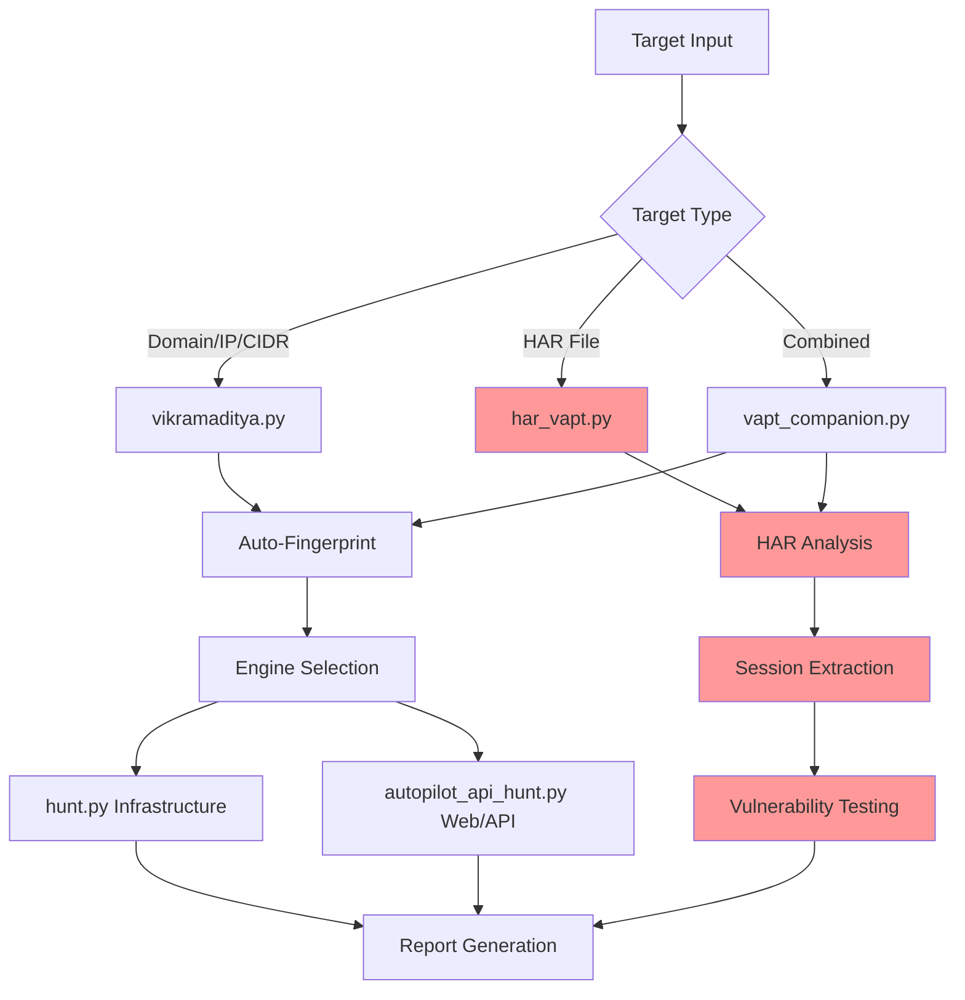

<div align="center">

```
 ██╗   ██╗██╗██╗  ██╗██████╗  █████╗ ███╗   ███╗ █████╗ ██████╗ ██╗████████╗██╗   ██╗ █████╗
 ██║   ██║██║██║ ██╔╝██╔══██╗██╔══██╗████╗ ████║██╔══██╗██╔══██╗██║╚══██╔══╝╚██╗ ██╔╝██╔══██╗
 ██║   ██║██║█████╔╝ ██████╔╝███████║██╔████╔██║███████║██║  ██║██║   ██║    ╚████╔╝ ███████║
 ╚██╗ ██╔╝██║██╔═██╗ ██╔══██╗██╔══██║██║╚██╔╝██║██╔══██║██║  ██║██║   ██║     ╚██╔╝  ██╔══██║
  ╚████╔╝ ██║██║  ██╗██║  ██║██║  ██║██║ ╚═╝ ██║██║  ██║██████╔╝██║   ██║      ██║   ██║  ██║
   ╚═══╝  ╚═╝╚═╝  ╚═╝╚═╝  ╚═╝╚═╝  ╚═╝╚═╝     ╚═╝╚═╝  ╚═╝╚═════╝ ╚═╝   ╚═╝      ╚═╝   ╚═╝  ╚═╝
```

**v7.4.6 — scope-lock hint always fires (removed dev-time selvas carve-out) + hidden dirs (.tmp, .cache) filtered from finding-class table + empty-findings diagnostic section: reporter now explains *what was scanned* (recon counts + target-shape hints) so a 0-findings report is never blank + reporter subdir coverage: 5 silently-dropped finding classes restored (mfa, saml, deserialize, import_export, supply_chain) + unknown-subdir warning log + README honesty pass + NAT64 FP fix + severity-spelling fix + email_audit per-check package + brain.py LLM bridge + hunt_journal auto-append + 553-test suite + email-auditor agent + sqlmap JSON API detection + anonymization proxy + sneaky_bits + /autopilot + /remember + /surface + recon-ranker + meme-coin + /intel + bb-methodology + credential store + /pickup + CI/CD + HackerOne MCP + CVSS 4.0 + HAR auth testing**

> *"He who seeks the truth must be ready to face the fire."*
> — inspired by the legend of Vikramaditya

[](LICENSE)
[](https://python.org)
[](https://www.gnu.org/software/bash/)
[](#multi-provider-ai)

[Quick Start](#quick-start) · [What's New in v7.x](#whats-new-in-v7x) · [Engagement Privacy](#engagement-privacy-v70v71) · [HAR-based Testing](#har-based-authenticated-testing) · [Architecture](#architecture) · [Vulnerability Coverage](#vulnerability-coverage) · [Reports](#reports) · [Installation](#installation) · [Contributing](#contributing)

---

**One target → Auto-fingerprint → Smart engine selection → AI writes exploit code → Professional report**

**🔥 NEW: HAR-based authenticated testing — Use real browser sessions for deep security testing**

</div>

---

## What's New in v7.x

v5 → v7 added **10 releases, 270 passing tests, 1 new security domain (client-data anonymization), 1 new web3 sub-domain (meme-coin / Solana / DEX LP), and a HackerOne MCP server.** Full changelog in [`CHANGELOG.md`](CHANGELOG.md).

### **🛡️ Engagement Privacy — anonymization proxy for Claude Code (v7.0 / v7.1)**

| Feature | Description |
|:--------|:------------|
| **Reverse proxy** (`llm_anon/proxy.py`) | FastAPI on `127.0.0.1:8080`. Point `ANTHROPIC_BASE_URL` at it; Claude Code never sees real client data. |
| **Regex detector** (`llm_anon/regex_detector.py`) | IPv4/IPv6/CIDR, MAC, email, URL, FQDN, AWS keys, API tokens, JWT, MD5/SHA1/SHA256/NTLM hashes. NTLM `lm:nt` pair beats two adjacent MD5s; CIDR beats bare IPv4. |
| **Deterministic surrogates** (`llm_anon/surrogates.py`) | RFC 5737 TEST-NET IPs, `.pentest.local` FQDNs, locally-administered MACs, length-preserving fake hashes. Same original → same surrogate within an engagement. |
| **SQLite vault** (`llm_anon/vault.py`) | Per-engagement mapping store. Engagement isolation — client A and client B never share surrogates. |
| **SSE-aware** | Anthropic's streaming `text_delta` events are parsed line-by-line; deanonymized in place; pass straight through to Claude Code so streaming stays live. |

Design credit: [zeroc00I/LLM-anonymization](https://github.com/zeroc00I/LLM-anonymization) (README-only spec — implementation is entirely original).

### **🪙 Web3 meme-coin / Solana / DEX LP security domain (v6.0)**

| Module | Catches |
|:-------|:--------|
| `token_scanner.py` (783 lines, EVM + Solana) | Unrestricted mint, unbounded fee/tax, trading toggles, hidden transfer hooks, blacklists, owner privileges, pause authority, honeypot logic |
| `web3/10-meme-coin-bugs.md` | 8 meme-coin bug classes + Immunefi paid examples |
| `web3/11-solana-token-audit.md` | SPL / Token-2022 / freeze-authority / transfer-hook attacks |
| `web3/12-dex-lp-attacks.md` | AMM / concentrated-liquidity / JIT |
| `skills/meme-coin-audit/SKILL.md` | Launch-audit workflow |
| `/token-scan <contract>` | Slash command |

### **🔧 Hunting workflow upgrades (v5.1 – v6.3)**

| Release | Addition |
|:--------|:---------|
| **v5.0** | CVSS 4.0 scoring (AT + VC/VI/VA + SC/SI/SA + Safety axis) — modern programs reward this |
| **v5.1** | HackerOne MCP server — live Hacktivity + program stats + safe-harbor lookup |
| **v5.2** | sisakulint CI/CD scanner — `pwn_request` / unpinned actions / script injection across whole orgs |
| **v5.3** | `/pickup` session resume + auto-logged session summaries — warm-restart over 20+ existing engagement histories |
| **v5.4** | `credential_store.py` — `.env`-backed auth headers, never logs raw values |
| **v5.5** | `bb-methodology` master skill — 5-phase non-linear hunting orchestrator |
| **v5.6** | `intel_engine.py` + `/intel` — cross-references CVEs against hunt memory to flag untested surface |
| **v6.1** | `/remember`, `/surface`, recon-ranker agent — fill the gap between "I ran recon" and "I started hunting" |
| **v6.2** | `/autopilot` agent — ties the existing autopilot engine to scope checking + checkpoint modes |
| **v6.3** | `sneaky_bits.py` — invisible-Unicode prompt injection encoder for LLM red-teaming |
| **v6.4** | **229-test suite** ported from upstream (audit log, hunt journal, scope checker, token scanner, intel engine, credential store, HackerOne MCP) |

### **📜 Original v4.1 capabilities (preserved)**

HAR-based authenticated testing, autonomous VAPT, multi-provider AI, Burp-style HTML reports — [see below](#har-based-authenticated-testing).

---

## Engagement Privacy (v7.0 / v7.1)

When the NDA says "don't send client data to third-party AI services" but you still want Claude Code's reasoning on real `nmap` / `crackmapexec` / `mimikatz` / Burp output:

```bash
# Terminal 1 — start the anonymization proxy
export ENGAGEMENT_ID=acme-2026-vapt
export ANTHROPIC_API_KEY=sk-ant-...            # forwarded to upstream as-is
python3 -m llm_anon.proxy                      # listens on 127.0.0.1:8080

# Terminal 2 — run Claude Code through the proxy
export ANTHROPIC_BASE_URL=http://127.0.0.1:8080
export ENGAGEMENT_ID=acme-2026-vapt            # must match Terminal 1
claude
```

**What Claude actually sees:**
```
nmap scan of 203.0.113.47 on xkqpzt.pentest.local returned OpenSSH 8.2
```
**What your terminal shows:**
```
nmap scan of 10.20.0.10 on dc01.acmecorp.local returned OpenSSH 8.2
```

Mappings persist in `~/.vikramaditya/anon_vault.db`, scoped by `ENGAGEMENT_ID`. Run `/anon` for command reference. See [`llm_anon/`](llm_anon/) and [`commands/anon.md`](commands/anon.md).

**Threat model:** prevents content-based correlation. Does **not** prevent query-pattern or timing correlation. Binds to `127.0.0.1` only. Not a compliance certification — review your contract.

---

## HAR-Based Authenticated Testing

### **🎯 Capture Real Sessions**

```bash
# Step 1: Capture browser session
# 1. Open target app in browser
# 2. Open DevTools (F12) → Network tab
# 3. Login and navigate authenticated areas
# 4. Right-click → Save as HAR file

# Step 2: Run authenticated VAPT
python3 har_vapt.py admin_session.har
```

### **🔥 What HAR Testing Finds**

- **SQL Injection** — Authentication bypass in login forms
- **File Upload RCE** — Malicious file uploads in admin panels
- **Authentication Bypass** — Admin functions accessible without credentials
- **IDOR** — User enumeration and unauthorized data access
- **XSS** — Cross-site scripting in authenticated parameters
- **Session Management** — Token security and session hijacking

### **🛠️ HAR Testing Tools**

```bash
# Complete HAR-based VAPT workflow
python3 har_vapt.py session.har                # All-in-one testing

# Individual components
python3 har_analyzer.py session.har            # Extract endpoints & tokens
python3 har_vapt_engine.py session_analysis.json  # Run vulnerability tests

# Combined infrastructure + authenticated testing
python3 vapt_companion.py --full example.com   # Best of both approaches

# Interactive suite with all tools
python3 vapt_suite.py                          # Unified interface
```

### **📊 Real-World Results**

Recent HAR-based testing on email platform:
- **83 endpoints** discovered from browser session
- **49 vulnerabilities** found including:
  - 32 Critical (File upload RCE)
  - 6 High (Authentication bypass)
  - 11 Medium (Session management)
- **Bearer token extraction** and security analysis
- **Complete attack surface** mapped from real usage

---

## What's New in v2.0

| Feature | v1.x | v2.0 |
|:--------|:-----|:-----|
| **Entry point** | 5+ scripts with flags (`hunt.py --target x --full`) | `python3 vikramaditya.py` — one command, interactive |
| **Target detection** | Manual: pick the right script | Auto: fingerprints tech stack, login, API, routes to right engine |
| **Brain role** | Supervisor only (CONTINUE/SKIP/INJECT) | **Writes and executes exploit code** — PoCs, bypasses, code audits |
| **Fix verification** | Manual retest | `--verify-fix` mode: brain reads deployed code, finds logic flaws, writes bypasses |
| **Code audit** | Not available | `--audit-code` mode: feed source code, brain finds vulns and writes PoCs |
| **Endpoint discovery** | Single main.js bundle only | All JS chunks (Vite, Next.js, CRA), dynamic imports, OpenAPI/Swagger |
| **Login detection** | Required `--login-url` flag | Auto-detects from 18+ common patterns + dev/staging endpoints |
| **API base path** | Required `--base-url` flag | Auto-probes `/api/`, `/v1/`, subdomains, same-origin detection |
| **URL dedup** | No dedup (scans thousands of identical news/video URLs) | Pattern-based collapse: 5000 → 50 unique code paths |
| **Scope lock** | `--scope-lock` flag | Interactive prompt: "scan this exact host only?" |
| **CLI args** | Required (`--target x --full --with-brain`) | `python3 vikramaditya.py example.com` — one arg, everything auto |
| **Banner** | Orange gradient | Indian flag colors (saffron, white, green, Ashoka blue) |

---

## The Legend

**Vikramaditya** — the legendary Indian emperor whose throne could only be ascended by one who sought truth fearlessly and judged without bias. His name means *"valour of the sun"*.

This tool operates the same way. Give it a target. Walk away. Come back to a full VAPT report — every vulnerability exposed, every weakness catalogued.

It was inspired by and evolved from [**claude-bug-bounty**](https://github.com/shuvonsec/claude-bug-bounty) — the original AI-assisted bug bounty automation platform that laid the recon pipeline, ReAct agent architecture, and AI analysis engine that powers this tool today.

---

## What It Does

Vikramaditya is an autonomous VAPT tool built for professional security consultants. You give it a target — a domain, a single IP, or an entire subnet. It runs the full assessment pipeline and produces a submission-ready report.

| Stage | What happens |
|:------|:-------------|
| 🔭 **Recon** | Subdomain enumeration, DNS resolution, live host discovery, URL crawling, JS analysis, secret extraction |
| 🔬 **Fingerprint** | Tech stack detection (httpx), CVE risk scoring, priority host ranking |
| 🔍 **Scan** | SQLi, XSS, SSTI, RCE, file upload, CORS, JWT, cloud misconfigs, framework exposure |
| 💥 **Exploit** | CMS exploit chains (Drupal, WordPress), Spring actuators, exposed admin panels |
| 🧠 **Analyze** | AI-powered triage — finds chains, ranks by impact, kills noise |
| 📋 **Report** | Burp Suite-style HTML report: executive summary, CVSS scores, PoC evidence, remediation |
| 🔐 **HAR Testing** | **NEW**: Browser session analysis, authenticated vulnerability testing, real-world attack simulation |

---

## Quick Start

```bash
git clone https://github.com/venkatas/vikramaditya.git
cd vikramaditya
chmod +x setup.sh && ./setup.sh      # installs all required tools

# Download BugTraceAI brain (security-tuned, recommended)
wget -c 'https://huggingface.co/BugTraceAI/BugTraceAI-Apex-G4-26B-Q4/resolve/main/BugTraceAI-Apex-G4-26B-Q4.gguf' -O /tmp/BugTraceAI-Apex-G4-26B-Q4.gguf
ollama create bugtraceai-apex -f Modelfiles/BugTraceAI-Modelfile

# Or use stock Gemma4 (also works well)
ollama pull gemma4:26b               # fast all-rounder brain (17GB)
```

### The Only Command You Need

```bash
# Fully autonomous — zero prompts (when Ollama is installed)
python3 vikramaditya.py example.com
python3 vikramaditya.py https://app.example.com --creds "user@domain.com:password"
python3 vikramaditya.py 10.0.0.0/24

# NEW: HAR-based authenticated testing
python3 har_vapt.py admin_session.har

# Combined infrastructure + authenticated testing
python3 vapt_companion.py --full example.com

# With fix verification
python3 vikramaditya.py https://app.example.com --creds "user:pass" --verify-fix "CSRF fixed via ols token"
```

When Ollama is installed, **zero prompts** — brain drives everything:
- Auto-fingerprints, auto-selects engine, auto-enables brain + active scanner
- Auto-generates report when done
- Only asks for credentials if login detected and `--creds` not provided

Without Ollama, falls back to interactive mode with prompts.

### HAR Testing Workflow

```bash
# Interactive HAR testing
python3 vapt_suite.py

# Quick HAR analysis
python3 har_analyzer.py session.har

# Complete HAR VAPT
python3 har_vapt.py session.har

# Combined assessment
python3 vapt_companion.py --full target.com
```

It will:

1. Ask for a target (URL, domain, IP, CIDR, **or HAR file**)
2. Auto-fingerprint the target (tech stack, login pages, API endpoints, JS bundles, OpenAPI specs)
3. **NEW**: Analyze HAR files for authenticated endpoints and session data
4. Show a summary of what it found and recommend the right scan type
5. Ask for credentials if a login page is detected (password input is hidden)
6. Enable the AI brain automatically if Ollama is installed
7. Offer **brain active scanner** — LLM writes and executes exploit code, not just supervises
8. **NEW**: Offer **HAR-based authenticated testing** for deep vulnerability analysis
9. Offer **fix verification** — developer says "fixed"? Brain reads the code and finds bypasses
10. Route to the right scan engine and run the full assessment
11. Offer to generate a professional report at the end

```
$ python3 vikramaditya.py app.example.com

  ────────────────────────────────────────────────────────
    TARGET SUMMARY
  ────────────────────────────────────────────────────────
    Target  : https://app.example.com
    Status  : HTTP 200
    Tech    : Vite, React
    Login   : /auth/login
    API     : https://app.example.com/v1
    JS      : 52 bundles, 80+ API calls found
    OpenAPI : found

    Recommended: Authenticated API VAPT
  ────────────────────────────────────────────────────────

  Proceed? [Y/n]: y
  Do you have credentials? [Y/n]: y
  Username / email: admin@example.com
  Password: ********
  Second account for IDOR / privilege escalation testing? [y/N]: n
  AI brain supervisor: enabled. Keep enabled? [Y/n]: y
  Run brain active scanner? (LLM writes + executes exploit code) [y/N]: y
  Verify a developer's fix claim? [y/N]: n

  [launching 12-phase brain-supervised API VAPT...]
  [then brain active scanner writes + runs exploit PoCs...]
```

### HAR File Testing Example

```
$ python3 har_vapt.py admin_session.har

  ────────────────────────────────────────────────────────
    HAR ANALYSIS SUMMARY
  ────────────────────────────────────────────────────────
    Target Domain     : app.example.com
    Total Endpoints   : 127
    Admin Endpoints   : 18
    File Uploads      : 3
    High-Value Targets: 31
    Authentication    : bearer_token
    Bearer Token      : eyJ0eXAiOiJKV1QiLCJh...

    Recommended Tests : sql_injection, file_upload_rce, auth_bypass
  ────────────────────────────────────────────────────────

  🚀 Starting comprehensive VAPT scan...
  🧪 Testing SQL Injection...
  🚨 [CRITICAL] SQL Injection: Authentication bypass confirmed
  🧪 Testing File Upload RCE...
  🚨 [CRITICAL] File Upload RCE: 4 malicious files uploaded successfully
  🧪 Testing Authentication Bypass...
  🚨 [HIGH] Authentication Bypass: Admin panels accessible without auth

  📊 Found 23 vulnerabilities (8 Critical, 5 High, 10 Medium)
  💾 Results saved to: har_vapt_results_20240414_143022.json
```

---

## Core Architecture

<div align="center">



</div>

### **File Structure**

```
vikramaditya/
├── vikramaditya.py              # Main orchestrator
├── hunt.py                      # Infrastructure VAPT
├── autopilot_api_hunt.py        # Web/API VAPT
├── har_analyzer.py              # HAR file analysis
├── har_vapt_engine.py           # HAR-based vulnerability testing
├── har_vapt.py                  # Complete HAR VAPT workflow
├── vapt_companion.py            # Combined infrastructure + HAR
├── vapt_suite.py                # Interactive unified interface
├── brain.py / brain_scanner.py  # AI analysis + exploit generation
├── agent.py                     # Autonomous ReAct agent
├── reporter.py                  # HTML/PDF report generation
├── recon.sh / scanner.sh        # Recon + vuln scanning pipelines
├── poc_*.py                     # Proof-of-concept scripts
├── validate.py                  # Finding validation (CVSS 4.0 — v5.0)
├── credential_store.py          # .env-backed auth store (v5.4)
├── intel_engine.py              # CVE + HackerOne + hunt-memory intel (v5.6)
├── token_scanner.py             # EVM + Solana meme-coin red flags (v6.0)
├── sneaky_bits.py               # LLM prompt-injection encoder (v6.3)
├── cicd_scanner.sh              # sisakulint GitHub Actions auditor (v5.2)
│
├── llm_anon/                    # 🛡️ Engagement privacy (v7.0 / v7.1)
│   ├── proxy.py                 # FastAPI reverse proxy for Claude Code
│   ├── regex_detector.py        # IP/hash/credential/FQDN/JWT patterns
│   ├── surrogates.py            # RFC 5737 / .pentest.local generator
│   ├── vault.py                 # SQLite per-engagement mapping store
│   └── anonymizer.py            # Facade for anonymize() / deanonymize()
│
├── mcp/hackerone-mcp/           # H1 GraphQL MCP server (v5.1)
├── memory/                      # Hunt journal, audit log, pattern DB
├── skills/                      # bug-bounty, bb-methodology, meme-coin-audit,
│                                #   report-writing, triage-validation,
│                                #   security-arsenal, web2-*, web3-audit
├── agents/                      # recon-agent, chain-builder, validator,
│                                #   report-writer, web3-auditor,
│                                #   token-auditor (v6.0), recon-ranker (v6.1),
│                                #   autopilot (v6.2)
├── commands/                    # /recon /hunt /validate /report /triage /chain
│                                #   /scope /web3-audit /cicd (v5.2)
│                                #   /pickup (v5.3) /intel (v5.6)
│                                #   /token-scan (v6.0) /remember /surface (v6.1)
│                                #   /autopilot (v6.2) /anon (v7.1)
└── tests/                       # 270 tests — pytest + pytest-asyncio
```

---

## Vulnerability Coverage

### **Infrastructure Testing (Original)**

| Category | Tools | Techniques |
|:---------|:------|:-----------|
| **Recon** | subfinder, assetfinder, amass, httpx | Subdomain enumeration, live host discovery, tech fingerprinting |
| **Scanning** | nuclei, sqlmap, naabu, feroxbuster | CVE detection, SQL injection, port scanning, directory bruteforce |
| **Exploitation** | manual + brain-generated PoCs | CMS exploits, Spring Boot actuators, cloud misconfigs |

### **Authenticated Testing (New)**

| Category | Vulnerability Types | HAR-Based Testing |
|:---------|:-------------------|:------------------|
| **Injection** | SQL injection, NoSQL injection, Command injection | ✅ Authentication bypass, Parameter injection |
| **Broken Auth** | Session management, Authentication bypass | ✅ Admin panel access, Invalid session acceptance |
| **Sensitive Data** | IDOR, Information disclosure | ✅ User enumeration, Unauthorized data access |
| **File Upload** | RCE, Path traversal, Filter bypass | ✅ Malicious uploads, Bypass techniques |
| **XSS** | Reflected, Stored, DOM-based | ✅ Parameter-based testing |
| **Session** | Token security, Hijacking | ✅ Bearer token analysis, Cookie security |

### **Web3 Meme-Coin / SPL / DEX LP (v6.0)**

| Category | What `token_scanner.py` flags | Reference |
|:---------|:-------------------------------|:----------|
| **Mint abuse** | Unrestricted mint, `onlyOwner` mint without cap | `web3/10-meme-coin-bugs.md` |
| **Fee traps** | Unbounded `setFee()`/`setTax()`, missing `MAX_FEE` | `web3/10` |
| **Trading toggles** | Reversible `enableTrading`, pause / unpause loops | `web3/10` |
| **Transfer hooks** | Hidden pre/post-transfer logic, fee-on-transfer accounting | `web3/10`, `web3/11` |
| **Blacklists / freeze authority** | Owner can blacklist/freeze user funds | `web3/11` (Solana) |
| **LP / AMM attacks** | Concentrated-liquidity, JIT sandwich, LP-share accounting | `web3/12` |

### **CI/CD & Supply Chain (v5.2)**

| Category | Tools | Detected |
|:---------|:------|:---------|
| **GitHub Actions** | `cicd_scanner.sh` (sisakulint wrapper) | `pwn_request`, script injection in `run:`, unpinned 3rd-party actions, missing `permissions:`, reusable-workflow privilege chains |
| **Org-wide batch** | `./cicd_scanner.sh "org:<name>" --recursive` | Scan every public repo in an organization |

### **LLM / AI Red-Team**

| Category | Tool | Use case |
|:---------|:-----|:---------|
| **Invisible Unicode injection** | `sneaky_bits.py` | U+2062 / U+2064 / Variant Selector encoding for indirect prompt-injection payloads |
| **HAR-based chatbot IDOR** | `har_vapt_engine.py` | Replay authenticated LLM app sessions against injection, tool-call abuse, context leaks |

### **Engagement Privacy (v7.0 / v7.1)**

| Category | Tool | Purpose |
|:---------|:-----|:--------|
| **Client-data anonymization** | `llm_anon/` | Transparent reverse proxy — real IPs / hashes / credentials / FQDNs never reach Anthropic |
| **Per-engagement vault** | `llm_anon/vault.py` | SQLite mapping store scoped by `ENGAGEMENT_ID` — no cross-client correlation |

### **AI-Powered Analysis**

- **Exploit Generation** — Brain writes custom PoC code for found vulnerabilities
- **Chain Discovery** — Identifies multi-step attack paths
- **False Positive Reduction** — AI triage removes noise
- **Fix Verification** — Reads deployed code, finds logic bypass opportunities
- **Impact Assessment** — Business risk scoring and prioritization

---

## Multi-Provider AI

| Provider | Models | Use Case |
|:---------|:-------|:---------|
| **Ollama** (Local) | BugTraceAI-Apex-G4, Gemma4, Llama3.1, Codestral | Primary brain, exploit generation, code analysis |
| **MLX** (Apple Silicon) | Gemma4-MLX, Llama3.1-MLX | Fast inference on M1/M2/M3 Macs |
| **OpenAI** | GPT-4o, GPT-4-Turbo | Premium analysis, complex reasoning |
| **Anthropic** | Claude 3.5 Sonnet, Claude 3 Opus | Code understanding, vulnerability research |
| **Google** | Gemini 1.5 Pro | Multimodal analysis, document processing |
| **xAI** | Grok-2 | Alternative reasoning, real-time knowledge |

Configure via environment variables or interactive setup.

---

## Reports

### **Professional VAPT Reports**

- **Executive Summary** — Business impact, risk scores, remediation timeline
- **Technical Findings** — Detailed vulnerability descriptions with PoC evidence
- **CVSS Scoring** — Industry-standard risk assessment
- **Remediation Guidance** — Step-by-step fix instructions
- **Compliance Mapping** — OWASP Top 10, CWE references

### **Output Formats**

```bash
# Generate HTML report
python3 reporter.py findings/ --client "Acme Corp" --consultant "Your Name"

# Multiple formats
python3 reporter.py findings/ --format html,pdf,json
```

Sample outputs:
- **HTML**: Burp Suite-style professional report
- **JSON**: Machine-readable findings for integration
- **PDF**: Executive presentation format
- **Markdown**: Documentation-friendly format

---

## Installation

### **Automated Setup**

```bash
git clone https://github.com/venkatas/vikramaditya.git
cd vikramaditya
chmod +x setup.sh && ./setup.sh
```

The setup script installs all required tools:
- **Core Tools**: httpx, subfinder, nuclei, sqlmap, naabu, feroxbuster
- **Python Dependencies**: requests, beautifulsoup4, selenium
- **AI Runtime**: Ollama (optional but recommended)

### **Manual Setup**

```bash
# Install Go tools
go install -v github.com/projectdiscovery/httpx/cmd/httpx@latest
go install -v github.com/projectdiscovery/subfinder/v2/cmd/subfinder@latest
go install -v github.com/projectdiscovery/nuclei/v3/cmd/nuclei@latest

# Install Python dependencies
pip install requests beautifulsoup4 selenium

# Install Ollama (for AI features)
curl -fsSL https://ollama.ai/install.sh | sh
ollama pull gemma4:26b
```

### **Docker Support**

```bash
docker build -t vikramaditya .
docker run -v $(pwd)/results:/app/results vikramaditya:latest example.com
```

---

## Professional Usage

### **VAPT Engagement Workflow**

1. **Scoping** — Define targets, obtain written authorization
2. **Reconnaissance** — `python3 vikramaditya.py target.com`
3. **Authenticated Testing** — Capture HAR files, run `python3 har_vapt.py session.har`
4. **Analysis** — AI-powered triage and impact assessment
5. **Reporting** — Generate client-ready reports
6. **Remediation Support** — Fix verification and retesting

### **Scan Capabilities**

- **Multi-target scanning** — Subnet, CIDR, and domain-range support (`hunt.py --target 10.0.0.0/24`)
- **Authenticated testing** — HAR-based session analysis and JSON-API auth replay
- **Structured output** — JSON findings files under `findings/<target>/` for downstream tooling
- **Hunt memory** — JSONL journal (`hunt-memory/journal.jsonl`) picked up by `/pickup <target>` on warm restart

### **Quality Assurance**

- **False positive reduction** — AI triage gate + regex dedup rules (see v7.1.2 and v7.4.2 for fixes that removed real FP classes)
- **Reproducible testing** — sqlmap command log + per-phase watchdog traces saved per session
- **Evidence collection** — request/response pairs, screenshots (via gowitness), scan logs

---

## Ethical Use & Legal Compliance

### **Authorization Requirements**

- ✅ **Only test systems you own or have explicit written permission to test**
- ✅ **Obtain proper documentation** before starting any assessment
- ✅ **Stay within defined scope** — use `--scope-lock` for strict boundaries
- ✅ **Follow responsible disclosure** for any findings

### **Methodology Alignment**

The tool does not carry any certification on its own. The operator is responsible for conducting engagements under the frameworks their client requires — typical choices:

- **OWASP Testing Guide v4.2** — the recon → param discovery → vuln scan → exploit chain Vikramaditya implements follows the OTG structure. Section references appear in report metadata when `--emit-otg-refs` is enabled.
- **NIST Cybersecurity Framework** — the scan→find→triage→report flow maps to Identify-Protect-Detect-Respond-Recover at the engagement level.
- **CERT-In VAPT format** — `tools/report_generator.py` supports the Indian CERT-In empanelled template when `--format cert-in` is passed.

Claim alignment only where it's honestly supported by your configuration.

### **Data Protection**

- **HAR files contain session data** — handle securely
- **Encrypt sensitive findings** during storage and transmission
- **Follow data retention policies** for client information
- **Implement secure deletion** procedures post-engagement

---

## Contributing

We welcome contributions! Here's how to get involved:

### **Development**

```bash
# Fork the repository
git clone https://github.com/venkatas/vikramaditya.git
cd vikramaditya

# Create a feature branch
git checkout -b feature/new-testing-module

# Make your changes
# Add tests for new functionality
# Update documentation

# Submit a pull request
```

### **Contribution Areas**

- **New vulnerability testing modules**
- **Additional AI model integrations**
- **Enhanced reporting formats**
- **Performance optimizations**
- **Documentation improvements**
- **HAR analysis enhancements**

### **Code Standards**

- **Python 3.10+** compatibility
- **Type hints** for new functions
- **Comprehensive docstrings**
- **Unit tests** for critical functionality
- **Security-first design** principles

---

## License & Support

### **License**

MIT License - see [LICENSE](LICENSE) file for details.

### **Support**

- 📧 **Email**: [venkat.9099@gmail.com](mailto:venkat.9099@gmail.com)
- 🐛 **Issues & PRs**: [github.com/venkatas/vikramaditya/issues](https://github.com/venkatas/vikramaditya/issues)

---

## Security Notice

This tool is designed for authorized security testing only. The developers assume no liability for misuse. Always ensure you have explicit written permission before testing any systems.

---

<div align="center">

**Built with ❤️ for the cybersecurity community**

*Inspired by the legend of Emperor Vikramaditya — fearless pursuit of truth*

**[⭐ Star this project](https://github.com/venkatas/vikramaditya)** if it helps secure your applications!

</div>